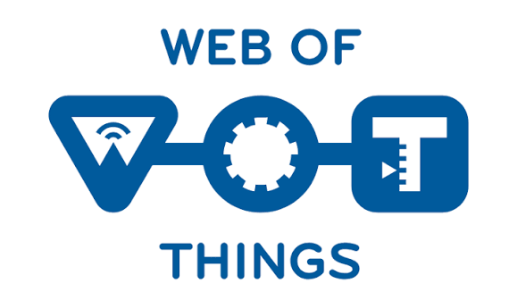
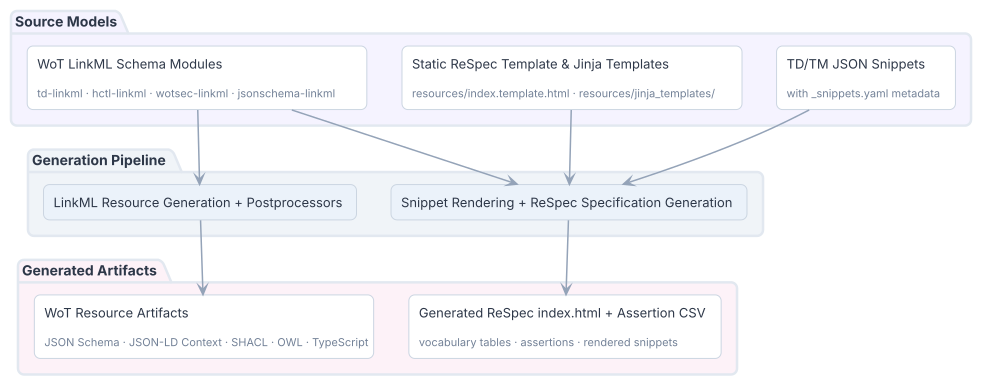

<div align="center">



# WoT Toolchain

**LinkML-based generation of Web of Things artifacts.**

[](https://github.com/w3c/wot-thing-description-toolchain-tmp/actions/workflows/main.yaml)
[](https://www.w3.org/WoT/)
[](https://www.python.org/)
[![LinkML](https://img.shields.io/badge/schema--driven-LinkML-2D6A4F?logo=data:image/png;base64,iVBORw0KGgoAAAANSUhEUgAAABQAAAAUCAYAAACNiR0NAAAAAXNSR0IArs4c6QAAAERlWElmTU0AKgAAAAgAAYdpAAQAAAABAAAAGgAAAAAAA6ABAAMAAAABAAEAAKACAAQAAAABAAAAFKADAAQAAAABAAAAFAAAAACy3fD9AAAD7UlEQVQ4EX1UYWwURRSeNzu3t3ctJwrt9VQiILGRSAzaaIJ/1CjVPyaKPWNMRf9pQqjJebXSFrbXohwHxDSEhEaDEotaAqap8QcxqVEjRn8QNQ0m0kCVQu9soRze3e7tzjxnNt3L2lbfj31v3/veN2/mzRsg/yHx/tw6XddbK9Vqr8V5FAhCWGNFg7GMAHrmSlfHH8ulwmLn3blc440ydiKFBCH0O0r5WXSwQCIS6UITImwBAltQiCmDuQemd+2aC3L8izAxkG2xOTGpBsM73PJnpmmKINi3HzVNNsHqXxKCP68J2l0w07/4sRphfG/uPscV+8OUpK72vnXeB/yfbtx38H7Xdt+NRoyOy50dvyssVZ/bTTPqctGnAetWZA2Zg5sfPHo0qmLLyYbBwYbm9440F7pSPzOg/ZZlDUhfWGE9wqpW106A/PjX7tQ55ay41W0XZ+YPI5HeRXLnoUORuXnr+PVS5WEVKuxOnyVAzxeLlaT6p7KSEBH4GDNix5TDE0TLCRuvrurP9vgupdUCUCVbXYSHLGp878d0oB9wAU+1jYxodDpfuocAXs+nXy/4AJmGxHWJQ2hmdSb7mk+W6M/1cTBue2Dl/NtjLZ+rvntypSf1pzSsbyan72ICRDNFuLgQW1CCEtfhOmMf2QiHGwdy+dVcbHRdnnpi1Y1N2+LjR6ZuRmXB5Fc/T57NFLrOBkaBrBBIi37A1xKgxQwjM18uz1oCT0u/cCDS/krTcLysG63y52Mfq7QQWASKKykSYckqa+XXQADEcaqha73pLk2IEzpAX8XsOHENI4ZMrsF8AxgYCLTM5EjJ7YLXMT8op8zLEFRecXmeJmL7HqlVyzmXKiQNAU4NLw2ZsZaF2BjFMJ0QiHfEc7m6IEA2Rm5aUxzEBBDS8BahmhxA9YPW9uOntzZ6OeaELvvADas4SfPpdIlSmMAKeTZASIkcViRQCfg8M8rjP9kWeUfT8WnBy+OfjD75zPub0onCmpbUJdO0vItdr5MhTvAFWaW3otwoYwT2Xn1zx5IXJZk8Wdne9m23a2svyias4VgZDWHxh5FbB9arFT3CS52dM/KEhhwLB5uz2RX1Gh1O4LoBGV96+l6dhLzc9vWngpNTug4kEqFNtgv31giVMbsnPcYQvpi1yYfq7CbMZHUhd1m11jxmhI36A7ZNviyXxFAsFD2jgN6hBzMaM/sfkdt/Q87npKaxUQPCv623CzcV5kIsFhNVbWOVO89pKAr5ns59wVxlLyFUTjXfl+f+bpWP6ePyzWvgCxdPk90jFPJA6Ve31LHxCzt32goflGUJgwA18OdmZrwrtbmpqXQymeTB+GL7H5S4pwvLuAY7AAAAAElFTkSuQmCC&logoColor=white)](https://linkml.io/)
[](https://opensource.org/licenses/MIT)

</div>

The WoT Toolchain is a work area for moving Web of Things (WoT) resource generation to LinkML schema modules. It is intended to replace the manual maintenance of WoT resources — SHACL shapes, JSON Schema, JSON-LD context files, OWL ontologies — and the `index.html` specification generation currently handled by the [existing toolchain](https://github.com/w3c/wot-thing-description/tree/main/toolchain) in the [W3C WoT Thing Description repository](https://github.com/w3c/wot-thing-description).

The toolchain models WoT resources in LinkML and generates the related artifacts from the same schema modules. Its aim is to prevent drift between those resources and the generated HTML sections of the [WoT Thing Description specification](https://www.w3.org/TR/wot-thing-description/).

> [!IMPORTANT]
> This work area is in progress. The toolchain is intended to be integrated into the official [TD](https://github.com/w3c/wot-thing-description/) repository after review and Working Group consensus.

## Usage

Requirements:

- Python 3.14, as declared in `pyproject.toml`;
- [uv](https://docs.astral.sh/uv/); and
- [Graphviz](https://graphviz.org/), required by `generate-wot-resources` to generate class-hierarchy diagrams for the index.html.

```bash
git clone https://github.com/w3c/wot-thing-description-toolchain-tmp.git
cd wot-thing-description-toolchain-tmp
uv sync
uv run pre-commit install
uv run wotis generate-wot-resources -d
uv run pytest tests/ -v
```

`wotis` is the Python command-line interface installed from this checkout by `uv sync`. `generate-wot-resources` generates the resource artifacts; `-d` additionally generates the ReSpec TD specification and its assertion CSV inventory. Run `uv run wotis --help` to view the available command and options.

Generated files are written under `resources/gens/`. Do not edit them directly.

## How It Works

The source models are maintained manually by the WoT Working Group:

- **WoT LinkML schema modules** — the root module [`td-linkml`](resources/schemas/thing_description.yaml) imports [`hctl-linkml`](resources/schemas/hypermedia.yaml), [`wotsec-linkml`](resources/schemas/wot_security.yaml), and [`jsonschema-linkml`](resources/schemas/jsonschema.yaml)
- **Static ReSpec template and Jinja templates** — `resources/index.template.html` and `resources/jinja_templates/`
- **TD/TM JSON snippets** — example snippets with `_snippets.yaml` metadata

From these source models, the generation pipeline has two paths:

1. **LinkML resource generation + postprocessors** takes the schema modules and produces the following WoT resource artifacts under `resources/gens/`:
   - **JSON Schema** (`jsonschema/jsonschema.json`) — validation of TD and TM JSON representations
   - **JSON-LD context** (`jsonldcontext/context.jsonld`) — TD JSON-LD terms, types, and containers
   - **SHACL shapes** (`shacl/shapes.shacl.ttl`) — validation of RDF representations of TD and TM instances
   - **OWL ontology** (`owl/ontology.owl.ttl`) — TD vocabulary terms and relationships
   - **TypeScript definitions** (`typescript/`) — type definitions for [node-wot](https://github.com/eclipse-thingweb/node-wot)
   - **Visualizations** (`visualization/`) — class-hierarchy diagrams

2. **Snippet rendering + ReSpec specification generation**, enabled by `-d`, takes the schema modules, `resources/index.template.html`, Jinja templates, and the TD/TM JSON snippets. It produces:
   - **Generated ReSpec `index.html`** — vocabulary tables, assertions, and rendered TD/TM example snippets
   - **Assertion CSV inventory** (`assertions/`) — inventory of assertions in the TD specification



Postprocessors are custom Python functions in [`src/wotis/postprocessors/`](src/wotis/postprocessors/). They modify a raw LinkML generator output only where the generator cannot represent a TD requirement directly or needs a documented adjustment to produce the required TD representation. [`Known LinkML Gaps`](docs/known-linkml-gaps.md) records each known limitation and workaround.

## Testing

Run the complete checks after generating artifacts:

```bash
uv run pytest tests/ -v
```

The checks include:

- `tests/test_td_instance_gate.py`: validates valid and invalid TD/TM 2.0 test instances against the generated JSON Schema.
- `tests/test_td_crosscheck.py`: compares generated-schema validation verdicts with the upstream W3C TD schemas manually specified in `resources/upstream/schemas/`.
- `tests/test_golden_diff.py`: compares generated JSON Schema, JSON-LD context, and generated specification sections with machine-updatable snapshots in `tests/snapshots/`.
- `tests/test_golden_form_structure.py` and `tests/test_spec_content_rendering.py`: check generated ReSpec structure and rendering behavior.
- `tests/test_snippet_schema.py` and `tests/test_snippet_crossrefs.py`: validate snippet metadata, source files, and ReSpec cross-references.

`resources/upstream/html/index.html` and `resources/upstream/assertions.csv` are upstream reference files used for TD specification and assertion-inventory comparison. `tests/snapshots/` contains this toolchain's generated-output snapshots; update them only with `uv run pytest tests/test_golden_diff.py --update-goldens` after reviewing an intended change.

Expected validation differences are listed in `tests/known_failures/`. Each listed case is an `xfail(strict=True)` baseline: when it starts passing, the test fails until the entry is removed. A new, unlisted validation difference fails the relevant test.

See [tests/README.md](tests/README.md) for the complete test inventory and the upstream reference files used by each check.

## Development

Useful commands:

```bash
# Generate resource artifacts only
uv run wotis generate-wot-resources

# Generate resource artifacts and the ReSpec TD specification
uv run wotis generate-wot-resources -d

# Run the complete test suite
uv run pytest tests/ -v

# Check linting
uv run ruff check .
```

Before changing a schema or generator, read the [modeling guidelines](docs/guidelines/index.md) for naming conventions, custom annotations, postprocessor patterns, and snippet authoring. For documented LinkML limitations and workarounds, see [`Known LinkML Gaps`](docs/known-linkml-gaps.md). Cross-reference terms used in the generated specification are defined in the [glossary](resources/xref/glossary.yaml), which maps vocabulary terms to their spec anchor IDs and aliases. Files under `resources/gens/` are generated outputs and should not be edited manually. Each postprocessor should document the LinkML limitation it addresses.

## Current Status

Current work focuses on JSON Schema parity, generated TD specification vocabulary tables, snippet validation, and assertion inventory comparison with the upstream TD repository. SHACL and OWL artifacts are generated; deeper automated consistency checks for those artifacts are not currently part of the test gates.

## Contributing

Contributions, issue reports, and review are welcome. Keep each change focused, generate the affected artifacts, and run the relevant checks before opening a pull request. For schema and generated-output changes, describe the compatibility impact in the pull request.

## License

Licensed under the MIT License.
