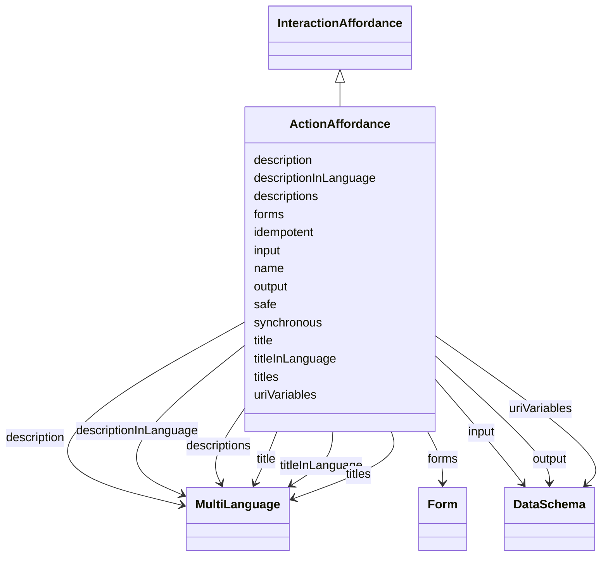

# Class: ActionAffordance


_An Interaction Affordance that allows to invoke a function of the Thing, which manipulates state (e.g., toggling a lamp on or off) or triggers a process on the Thing (e.g., dim a lamp over time)._


URI: [td:ActionAffordance](https://www.w3.org/2019/wot/td#ActionAffordance)





## Inheritance
* [InteractionAffordance](InteractionAffordance.md)
    * **ActionAffordance**


## Slots

| Name | Cardinality and Range | Description | Inheritance |
| ---  | --- | --- | --- |
| [safe](safe.md) | 0..1 <br/> [Boolean](Boolean.md) | Signals if the action is safe (=true) or not | direct |
| [synchronous](synchronous.md) | 0..1 <br/> [Boolean](Boolean.md) | Indicates whether the action is synchronous (=true) or not | direct |
| [idempotent](idempotent.md) | 0..1 <br/> [Boolean](Boolean.md) | Indicates whether the action is idempotent (=true) or not | direct |
| [input](input.md) | 0..1 <br/> [DataSchema](DataSchema.md) | Used to define the input data schema of the action | direct |
| [output](output.md) | 0..1 <br/> [DataSchema](DataSchema.md) | Used to define the output data schema of the action | direct |
| [titles](titles.md) | 0..* <br/> [MultiLanguage](MultiLanguage.md) |  | [InteractionAffordance](InteractionAffordance.md) |
| [descriptions](descriptions.md) | 0..* <br/> [MultiLanguage](MultiLanguage.md) | TODO, check, according to the description a description should not contain a ... | [InteractionAffordance](InteractionAffordance.md) |
| [title](title.md) | 0..1 <br/> [MultiLanguage](MultiLanguage.md) | Provides a human-readable title (e | [InteractionAffordance](InteractionAffordance.md) |
| [description](description.md) | 0..1 <br/> [MultiLanguage](MultiLanguage.md) |  | [InteractionAffordance](InteractionAffordance.md) |
| [titleInLanguage](titleInLanguage.md) | 0..1 <br/> [MultiLanguage](MultiLanguage.md) | title of the TD element (Thing, interaction affordance, security scheme or da... | [InteractionAffordance](InteractionAffordance.md) |
| [descriptionInLanguage](descriptionInLanguage.md) | 0..1 <br/> [MultiLanguage](MultiLanguage.md) | description of the TD element (Thing, interaction affordance, security scheme... | [InteractionAffordance](InteractionAffordance.md) |
| [name](name.md) | 1..1 <br/> [String](String.md) | Indexing property to store entity names when serializing them in a JSON-LD @i... | [InteractionAffordance](InteractionAffordance.md) |
| [uriVariables](uriVariables.md) | 0..* <br/> [DataSchema](DataSchema.md) | Define URI template variables according to RFC6570 as collection based on sch... | [InteractionAffordance](InteractionAffordance.md) |
| [forms](forms.md) | 0..* <br/> [Form](Form.md) | Set of form hypermedia controls that describe how an operation can be perform... | [InteractionAffordance](InteractionAffordance.md) |


## Usages

| used by | used in | type | used |
| ---  | --- | --- | --- |
| [Thing](Thing.md) | [actions](actions.md) | range | [ActionAffordance](ActionAffordance.md) |


## Identifier and Mapping Information


### Schema Source


* from schema: td


## Mappings

| Mapping Type | Mapped Value |
| ---  | ---  |
| self | td:ActionAffordance |
| native | td:ActionAffordance |


## LinkML Source

<!-- TODO: investigate https://stackoverflow.com/questions/37606292/how-to-create-tabbed-code-blocks-in-mkdocs-or-sphinx -->

### Direct

<details>
```yaml
name: ActionAffordance
description: An Interaction Affordance that allows to invoke a function of the Thing,
  which manipulates state (e.g., toggling a lamp on or off) or triggers a process
  on the Thing (e.g., dim a lamp over time).
from_schema: td
is_a: InteractionAffordance
attributes:
  safe:
    name: safe
    description: Signals if the action is safe (=true) or not. Used to signal if there
      is no internal state (cf. resource state) is changed when invoking an Action.
    from_schema: td
    rank: 1000
    domain_of:
    - ActionAffordance
    range: boolean
  synchronous:
    name: synchronous
    description: Indicates whether the action is synchronous (=true) or not. A synchronous
      action means that the response of action contains all the information about
      the result of the action and no further querying about the status of the action
      is needed. Lack of this keyword means that no claim on the synchronicity of
      the action can be made.
    from_schema: td
    rank: 1000
    domain_of:
    - ActionAffordance
    range: boolean
  idempotent:
    name: idempotent
    description: Indicates whether the action is idempotent (=true) or not. Informs
      whether the action can be called repeatedly with the same results, if present,
      based on the same input.
    from_schema: td
    rank: 1000
    domain_of:
    - ActionAffordance
    range: boolean
  input:
    name: input
    description: Used to define the input data schema of the action.
    from_schema: td
    rank: 1000
    domain_of:
    - ActionAffordance
    range: DataSchema
  output:
    name: output
    description: Used to define the output data schema of the action.
    from_schema: td
    rank: 1000
    domain_of:
    - ActionAffordance
    range: DataSchema
class_uri: td:ActionAffordance

```
</details>

### Induced

<details>
```yaml
name: ActionAffordance
description: An Interaction Affordance that allows to invoke a function of the Thing,
  which manipulates state (e.g., toggling a lamp on or off) or triggers a process
  on the Thing (e.g., dim a lamp over time).
from_schema: td
is_a: InteractionAffordance
attributes:
  safe:
    name: safe
    description: Signals if the action is safe (=true) or not. Used to signal if there
      is no internal state (cf. resource state) is changed when invoking an Action.
    from_schema: td
    rank: 1000
    alias: safe
    owner: ActionAffordance
    domain_of:
    - ActionAffordance
    range: boolean
  synchronous:
    name: synchronous
    description: Indicates whether the action is synchronous (=true) or not. A synchronous
      action means that the response of action contains all the information about
      the result of the action and no further querying about the status of the action
      is needed. Lack of this keyword means that no claim on the synchronicity of
      the action can be made.
    from_schema: td
    rank: 1000
    alias: synchronous
    owner: ActionAffordance
    domain_of:
    - ActionAffordance
    range: boolean
  idempotent:
    name: idempotent
    description: Indicates whether the action is idempotent (=true) or not. Informs
      whether the action can be called repeatedly with the same results, if present,
      based on the same input.
    from_schema: td
    rank: 1000
    alias: idempotent
    owner: ActionAffordance
    domain_of:
    - ActionAffordance
    range: boolean
  input:
    name: input
    description: Used to define the input data schema of the action.
    from_schema: td
    rank: 1000
    alias: input
    owner: ActionAffordance
    domain_of:
    - ActionAffordance
    range: DataSchema
  output:
    name: output
    description: Used to define the output data schema of the action.
    from_schema: td
    rank: 1000
    alias: output
    owner: ActionAffordance
    domain_of:
    - ActionAffordance
    range: DataSchema
  titles:
    name: titles
    from_schema: td
    rank: 1000
    multivalued: true
    alias: titles
    owner: ActionAffordance
    domain_of:
    - InteractionAffordance
    - Thing
    range: MultiLanguage
    inlined: true
  descriptions:
    name: descriptions
    description: TODO, check, according to the description a description should not
      contain a lang tag.
    from_schema: td
    rank: 1000
    multivalued: true
    alias: descriptions
    owner: ActionAffordance
    domain_of:
    - SecurityScheme
    - InteractionAffordance
    - Thing
    range: MultiLanguage
    inlined: true
  title:
    name: title
    description: Provides a human-readable title (e.g., display a text for UI representation)
      based on a default language.
    from_schema: td
    rank: 1000
    slot_uri: td:title
    alias: title
    owner: ActionAffordance
    domain_of:
    - DataSchema
    - InteractionAffordance
    - Thing
    range: MultiLanguage
  description:
    name: description
    from_schema: td
    rank: 1000
    alias: description
    owner: ActionAffordance
    domain_of:
    - SecurityScheme
    - DataSchema
    - InteractionAffordance
    - Thing
    range: MultiLanguage
  titleInLanguage:
    name: titleInLanguage
    description: title of the TD element (Thing, interaction affordance, security
      scheme or data scheme) with language tag. By convention, a language tag must
      be added to the object of descriptionInLanguage. Otherwise use description.
    from_schema: td
    rank: 1000
    alias: titleInLanguage
    owner: ActionAffordance
    domain_of:
    - DataSchema
    - InteractionAffordance
    - Thing
    range: MultiLanguage
  descriptionInLanguage:
    name: descriptionInLanguage
    description: description of the TD element (Thing, interaction affordance, security
      scheme or data scheme) with language tag. By convention, a language tag must
      be added to the object of descriptionInLanguage. Otherwise use description.
    from_schema: td
    rank: 1000
    alias: descriptionInLanguage
    owner: ActionAffordance
    domain_of:
    - DataSchema
    - InteractionAffordance
    - Thing
    range: MultiLanguage
  name:
    name: name
    description: Indexing property to store entity names when serializing them in
      a JSON-LD @index container.
    from_schema: td
    rank: 1000
    identifier: true
    alias: name
    owner: ActionAffordance
    domain_of:
    - InteractionAffordance
    range: string
    required: true
  uriVariables:
    name: uriVariables
    description: 'Define URI template variables according to RFC6570 as collection
      based on schema specifications. The individual variables DataSchema cannot be
      an ObjectSchema or an ArraySchema. TODO: range is not obvious from the ontology.'
    from_schema: td
    rank: 1000
    multivalued: true
    alias: uriVariables
    owner: ActionAffordance
    domain_of:
    - InteractionAffordance
    range: DataSchema
  forms:
    name: forms
    description: Set of form hypermedia controls that describe how an operation can
      be performed.
    from_schema: td
    rank: 1000
    multivalued: true
    alias: forms
    owner: ActionAffordance
    domain_of:
    - InteractionAffordance
    - Thing
    range: Form
class_uri: td:ActionAffordance

```
</details>