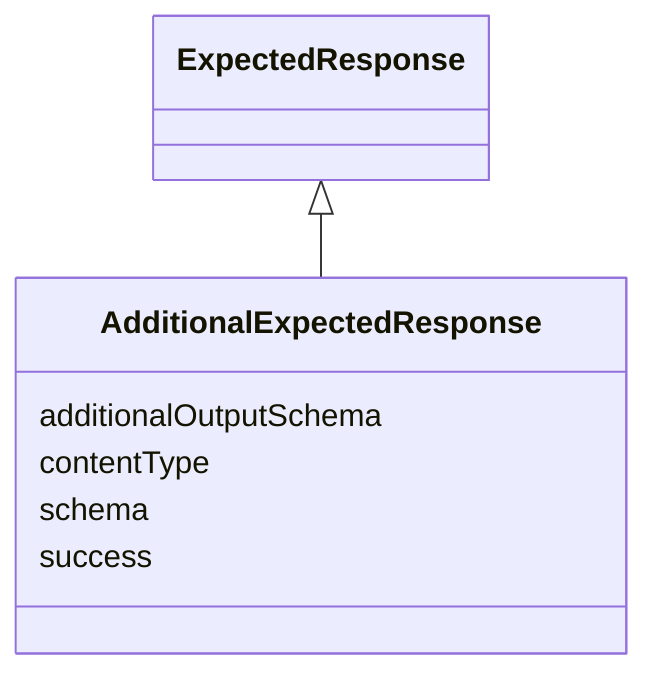

# Class: AdditionalExpectedResponse


_Communication metadata describing the expected response message for additional responses._


URI: [hctl:AdditionalExpectedResponse](https://www.w3.org/2019/wot/hypermedia#AdditionalExpectedResponse)





## Inheritance
* [ExpectedResponse](ExpectedResponse.md)
    * **AdditionalExpectedResponse**


## Slots

| Name | Cardinality and Range | Description | Inheritance |
| ---  | --- | --- | --- |
| [additionalOutputSchema](additionalOutputSchema.md) | 0..1 <br/> [String](String.md) | This optional term can be used to define a data schema for an additional resp... | direct |
| [success](success.md) | 0..1 <br/> [Boolean](Boolean.md) | Signals if the additional response should not be considered an error | direct |
| [schema](schema.md) | 0..1 <br/> [String](String.md) | TODO Check, was not in hctl ontology, if not could be source of discrepancy | direct |
| [contentType](contentType.md) | 1 <br/> [String](String.md) | TODO Check, was not in hctl ontology, if not could be source of discrepancy | [ExpectedResponse](ExpectedResponse.md) |


## Usages

| used by | used in | type | used |
| ---  | --- | --- | --- |
| [Form](Form.md) | [additionalReturns](additionalReturns.md) | range | [AdditionalExpectedResponse](AdditionalExpectedResponse.md) |


## Identifier and Mapping Information


### Schema Source


* from schema: td


## Mappings

| Mapping Type | Mapped Value |
| ---  | ---  |
| self | hctl:AdditionalExpectedResponse |
| native | td:AdditionalExpectedResponse |


## LinkML Source

<!-- TODO: investigate https://stackoverflow.com/questions/37606292/how-to-create-tabbed-code-blocks-in-mkdocs-or-sphinx -->

### Direct

<details>
```yaml
name: AdditionalExpectedResponse
description: Communication metadata describing the expected response message for additional
  responses.
from_schema: td
rank: 1000
is_a: ExpectedResponse
attributes:
  additionalOutputSchema:
    name: additionalOutputSchema
    description: This optional term can be used to define a data schema for an additional
      response if it differs from the default output data schema. Rather than a DataSchema
      object, the name of a previous definition given in a SchemaDefinitions map must
      be used.
    from_schema: td
    rank: 1000
    domain_of:
    - AdditionalExpectedResponse
  success:
    name: success
    description: Signals if the additional response should not be considered an error.
    from_schema: td
    rank: 1000
    domain_of:
    - AdditionalExpectedResponse
    range: boolean
  schema:
    name: schema
    description: TODO Check, was not in hctl ontology, if not could be source of discrepancy
    from_schema: td
    rank: 1000
    domain_of:
    - AdditionalExpectedResponse
class_uri: hctl:AdditionalExpectedResponse

```
</details>

### Induced

<details>
```yaml
name: AdditionalExpectedResponse
description: Communication metadata describing the expected response message for additional
  responses.
from_schema: td
rank: 1000
is_a: ExpectedResponse
attributes:
  additionalOutputSchema:
    name: additionalOutputSchema
    description: This optional term can be used to define a data schema for an additional
      response if it differs from the default output data schema. Rather than a DataSchema
      object, the name of a previous definition given in a SchemaDefinitions map must
      be used.
    from_schema: td
    rank: 1000
    alias: additionalOutputSchema
    owner: AdditionalExpectedResponse
    domain_of:
    - AdditionalExpectedResponse
    range: string
  success:
    name: success
    description: Signals if the additional response should not be considered an error.
    from_schema: td
    rank: 1000
    alias: success
    owner: AdditionalExpectedResponse
    domain_of:
    - AdditionalExpectedResponse
    range: boolean
  schema:
    name: schema
    description: TODO Check, was not in hctl ontology, if not could be source of discrepancy
    from_schema: td
    rank: 1000
    alias: schema
    owner: AdditionalExpectedResponse
    domain_of:
    - AdditionalExpectedResponse
    range: string
  contentType:
    name: contentType
    description: TODO Check, was not in hctl ontology, if not could be source of discrepancy
    from_schema: td
    rank: 1000
    alias: contentType
    owner: AdditionalExpectedResponse
    domain_of:
    - ExpectedResponse
    - Form
    range: string
    required: true
class_uri: hctl:AdditionalExpectedResponse

```
</details>