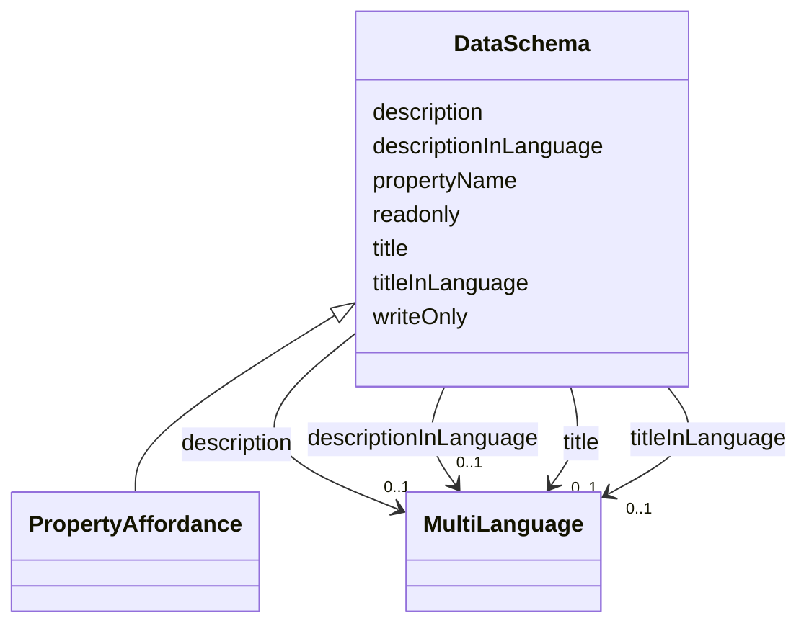

# Class: DataSchema


_Metadata that describes the data format used. It can be used for validation._


URI: [jsonschema:DataSchema](https://www.w3.org/2019/wot/json-schema#DataSchema)





<!-- no inheritance hierarchy -->


## Slots

| Name | Cardinality and Range | Description | Inheritance |
| ---  | --- | --- | --- |
| [description](description.md) | 0..1 <br/> [MultiLanguage](MultiLanguage.md) |  | direct |
| [title](title.md) | 0..1 <br/> [MultiLanguage](MultiLanguage.md) | Provides a human-readable title (e | direct |
| [titleInLanguage](titleInLanguage.md) | 0..1 <br/> [MultiLanguage](MultiLanguage.md) | title of the TD element (Thing, interaction affordance, security scheme or da... | direct |
| [descriptionInLanguage](descriptionInLanguage.md) | 0..1 <br/> [MultiLanguage](MultiLanguage.md) | description of the TD element (Thing, interaction affordance, security scheme... | direct |
| [propertyName](propertyName.md) | 0..1 <br/> [String](String.md) | Used to store the indexing name in the parent object when this schema appears... | direct |
| [writeOnly](writeOnly.md) | 0..1 <br/> [String](String.md) | Boolean value that is a hint to indicate whether a property interaction/value... | direct |
| [readonly](readonly.md) | 0..1 <br/> [String](String.md) | Boolean value that is a hint to indicate whether a property interaction/value... | direct |


## Usages

| used by | used in | type | used |
| ---  | --- | --- | --- |
| [InteractionAffordance](InteractionAffordance.md) | [uriVariables](uriVariables.md) | range | [DataSchema](DataSchema.md) |
| [PropertyAffordance](PropertyAffordance.md) | [uriVariables](uriVariables.md) | range | [DataSchema](DataSchema.md) |
| [ActionAffordance](ActionAffordance.md) | [input](input.md) | range | [DataSchema](DataSchema.md) |
| [ActionAffordance](ActionAffordance.md) | [output](output.md) | range | [DataSchema](DataSchema.md) |
| [ActionAffordance](ActionAffordance.md) | [uriVariables](uriVariables.md) | range | [DataSchema](DataSchema.md) |
| [EventAffordance](EventAffordance.md) | [subscription](subscription.md) | range | [DataSchema](DataSchema.md) |
| [EventAffordance](EventAffordance.md) | [cancellation](cancellation.md) | range | [DataSchema](DataSchema.md) |
| [EventAffordance](EventAffordance.md) | [notification](notification.md) | range | [DataSchema](DataSchema.md) |
| [EventAffordance](EventAffordance.md) | [notificationResponse](notificationResponse.md) | range | [DataSchema](DataSchema.md) |
| [EventAffordance](EventAffordance.md) | [uriVariables](uriVariables.md) | range | [DataSchema](DataSchema.md) |
| [Thing](Thing.md) | [schemaDefinitions](schemaDefinitions.md) | range | [DataSchema](DataSchema.md) |


## Identifier and Mapping Information


### Schema Source


* from schema: td


## Mappings

| Mapping Type | Mapped Value |
| ---  | ---  |
| self | jsonschema:DataSchema |
| native | td:DataSchema |


## LinkML Source

<!-- TODO: investigate https://stackoverflow.com/questions/37606292/how-to-create-tabbed-code-blocks-in-mkdocs-or-sphinx -->

### Direct

<details>
```yaml
name: DataSchema
description: Metadata that describes the data format used. It can be used for validation.
from_schema: td
rank: 1000
slots:
- description
- title
- titleInLanguage
- descriptionInLanguage
attributes:
  propertyName:
    name: propertyName
    description: Used to store the indexing name in the parent object when this schema
      appears as a property of an object schema.
    from_schema: td
    rank: 1000
    domain_of:
    - DataSchema
  writeOnly:
    name: writeOnly
    description: Boolean value that is a hint to indicate whether a property interaction/value
      is write only (=true) or not (=false).
    from_schema: td
    rank: 1000
    domain_of:
    - DataSchema
  readonly:
    name: readonly
    description: Boolean value that is a hint to indicate whether a property interaction/value
      is read only (=true) or not (=false).
    from_schema: td
    rank: 1000
    domain_of:
    - DataSchema
class_uri: jsonschema:DataSchema

```
</details>

### Induced

<details>
```yaml
name: DataSchema
description: Metadata that describes the data format used. It can be used for validation.
from_schema: td
rank: 1000
attributes:
  propertyName:
    name: propertyName
    description: Used to store the indexing name in the parent object when this schema
      appears as a property of an object schema.
    from_schema: td
    rank: 1000
    alias: propertyName
    owner: DataSchema
    domain_of:
    - DataSchema
    range: string
  writeOnly:
    name: writeOnly
    description: Boolean value that is a hint to indicate whether a property interaction/value
      is write only (=true) or not (=false).
    from_schema: td
    rank: 1000
    alias: writeOnly
    owner: DataSchema
    domain_of:
    - DataSchema
    range: string
  readonly:
    name: readonly
    description: Boolean value that is a hint to indicate whether a property interaction/value
      is read only (=true) or not (=false).
    from_schema: td
    rank: 1000
    alias: readonly
    owner: DataSchema
    domain_of:
    - DataSchema
    range: string
  description:
    name: description
    from_schema: td
    rank: 1000
    alias: description
    owner: DataSchema
    domain_of:
    - SecurityScheme
    - DataSchema
    - InteractionAffordance
    - Thing
    range: MultiLanguage
  title:
    name: title
    description: Provides a human-readable title (e.g., display a text for UI representation)
      based on a default language.
    from_schema: td
    rank: 1000
    slot_uri: td:title
    alias: title
    owner: DataSchema
    domain_of:
    - DataSchema
    - InteractionAffordance
    - Thing
    range: MultiLanguage
  titleInLanguage:
    name: titleInLanguage
    description: title of the TD element (Thing, interaction affordance, security
      scheme or data scheme) with language tag. By convention, a language tag must
      be added to the object of descriptionInLanguage. Otherwise use description.
    from_schema: td
    rank: 1000
    alias: titleInLanguage
    owner: DataSchema
    domain_of:
    - DataSchema
    - InteractionAffordance
    - Thing
    range: MultiLanguage
  descriptionInLanguage:
    name: descriptionInLanguage
    description: description of the TD element (Thing, interaction affordance, security
      scheme or data scheme) with language tag. By convention, a language tag must
      be added to the object of descriptionInLanguage. Otherwise use description.
    from_schema: td
    rank: 1000
    alias: descriptionInLanguage
    owner: DataSchema
    domain_of:
    - DataSchema
    - InteractionAffordance
    - Thing
    range: MultiLanguage
class_uri: jsonschema:DataSchema

```
</details>