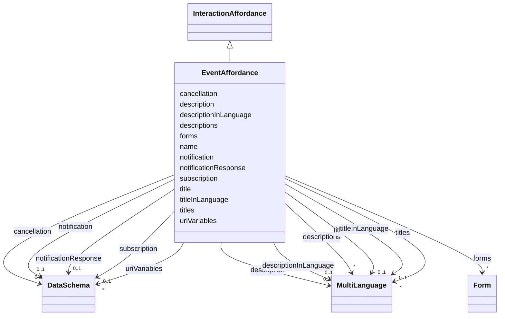

# Class: EventAffordance


_An Interaction Affordance that describes an event source, which asynchronously pushes event data to Consumers (e.g., overhearing alerts)._


URI: [td:EventAffordance](https://www.w3.org/2019/wot/td#EventAffordance)





## Inheritance
* [InteractionAffordance](InteractionAffordance.md)
    * **EventAffordance**


## Slots

| Name | Cardinality and Range | Description | Inheritance |
| ---  | --- | --- | --- |
| [subscription](subscription.md) | 0..1 <br/> [DataSchema](DataSchema.md) | Defines data that needs to be passed upon subscription, e | direct |
| [cancellation](cancellation.md) | 0..1 <br/> [DataSchema](DataSchema.md) | Defines any data that needs to be passed to cancel a subscription, e | direct |
| [notification](notification.md) | 0..1 <br/> [DataSchema](DataSchema.md) | Defines the data schema of the Event instance messages pushed by the Thing | direct |
| [notificationResponse](notificationResponse.md) | 0..1 <br/> [DataSchema](DataSchema.md) | Defines the data schema of the Event response messages sent by the consumer i... | direct |
| [titles](titles.md) | * <br/> [MultiLanguage](MultiLanguage.md) |  | [InteractionAffordance](InteractionAffordance.md) |
| [descriptions](descriptions.md) | * <br/> [MultiLanguage](MultiLanguage.md) | TODO, check, according to the description a description should not contain a ... | [InteractionAffordance](InteractionAffordance.md) |
| [title](title.md) | 0..1 <br/> [MultiLanguage](MultiLanguage.md) | Provides a human-readable title (e | [InteractionAffordance](InteractionAffordance.md) |
| [description](description.md) | 0..1 <br/> [MultiLanguage](MultiLanguage.md) |  | [InteractionAffordance](InteractionAffordance.md) |
| [titleInLanguage](titleInLanguage.md) | 0..1 <br/> [MultiLanguage](MultiLanguage.md) | title of the TD element (Thing, interaction affordance, security scheme or da... | [InteractionAffordance](InteractionAffordance.md) |
| [descriptionInLanguage](descriptionInLanguage.md) | 0..1 <br/> [MultiLanguage](MultiLanguage.md) | description of the TD element (Thing, interaction affordance, security scheme... | [InteractionAffordance](InteractionAffordance.md) |
| [name](name.md) | 1 <br/> [String](String.md) | Indexing property to store entity names when serializing them in a JSON-LD @i... | [InteractionAffordance](InteractionAffordance.md) |
| [uriVariables](uriVariables.md) | * <br/> [DataSchema](DataSchema.md) | Define URI template variables according to RFC6570 as collection based on sch... | [InteractionAffordance](InteractionAffordance.md) |
| [forms](forms.md) | * <br/> [Form](Form.md) | Set of form hypermedia controls that describe how an operation can be perform... | [InteractionAffordance](InteractionAffordance.md) |


## Usages

| used by | used in | type | used |
| ---  | --- | --- | --- |
| [Thing](Thing.md) | [events](events.md) | range | [EventAffordance](EventAffordance.md) |


## Identifier and Mapping Information


### Schema Source


* from schema: td


## Mappings

| Mapping Type | Mapped Value |
| ---  | ---  |
| self | td:EventAffordance |
| native | td:EventAffordance |


## LinkML Source

<!-- TODO: investigate https://stackoverflow.com/questions/37606292/how-to-create-tabbed-code-blocks-in-mkdocs-or-sphinx -->

### Direct

<details>
```yaml
name: EventAffordance
description: An Interaction Affordance that describes an event source, which asynchronously
  pushes event data to Consumers (e.g., overhearing alerts).
from_schema: td
rank: 1000
is_a: InteractionAffordance
attributes:
  subscription:
    name: subscription
    description: Defines data that needs to be passed upon subscription, e.g., filters
      or message format for setting up Webhooks.
    from_schema: td
    rank: 1000
    domain_of:
    - EventAffordance
    range: DataSchema
  cancellation:
    name: cancellation
    description: Defines any data that needs to be passed to cancel a subscription,
      e.g., a specific message to remove a Webhook.
    from_schema: td
    rank: 1000
    domain_of:
    - EventAffordance
    range: DataSchema
  notification:
    name: notification
    description: Defines the data schema of the Event instance messages pushed by
      the Thing.
    from_schema: td
    rank: 1000
    domain_of:
    - EventAffordance
    range: DataSchema
  notificationResponse:
    name: notificationResponse
    description: Defines the data schema of the Event response messages sent by the
      consumer in a response to a data message.
    from_schema: td
    rank: 1000
    domain_of:
    - EventAffordance
    range: DataSchema
class_uri: td:EventAffordance

```
</details>

### Induced

<details>
```yaml
name: EventAffordance
description: An Interaction Affordance that describes an event source, which asynchronously
  pushes event data to Consumers (e.g., overhearing alerts).
from_schema: td
rank: 1000
is_a: InteractionAffordance
attributes:
  subscription:
    name: subscription
    description: Defines data that needs to be passed upon subscription, e.g., filters
      or message format for setting up Webhooks.
    from_schema: td
    rank: 1000
    alias: subscription
    owner: EventAffordance
    domain_of:
    - EventAffordance
    range: DataSchema
  cancellation:
    name: cancellation
    description: Defines any data that needs to be passed to cancel a subscription,
      e.g., a specific message to remove a Webhook.
    from_schema: td
    rank: 1000
    alias: cancellation
    owner: EventAffordance
    domain_of:
    - EventAffordance
    range: DataSchema
  notification:
    name: notification
    description: Defines the data schema of the Event instance messages pushed by
      the Thing.
    from_schema: td
    rank: 1000
    alias: notification
    owner: EventAffordance
    domain_of:
    - EventAffordance
    range: DataSchema
  notificationResponse:
    name: notificationResponse
    description: Defines the data schema of the Event response messages sent by the
      consumer in a response to a data message.
    from_schema: td
    rank: 1000
    alias: notificationResponse
    owner: EventAffordance
    domain_of:
    - EventAffordance
    range: DataSchema
  titles:
    name: titles
    from_schema: td
    rank: 1000
    multivalued: true
    alias: titles
    owner: EventAffordance
    domain_of:
    - InteractionAffordance
    - Thing
    range: MultiLanguage
    inlined: true
  descriptions:
    name: descriptions
    description: TODO, check, according to the description a description should not
      contain a lang tag.
    from_schema: td
    rank: 1000
    multivalued: true
    alias: descriptions
    owner: EventAffordance
    domain_of:
    - SecurityScheme
    - InteractionAffordance
    - Thing
    range: MultiLanguage
    inlined: true
  title:
    name: title
    description: Provides a human-readable title (e.g., display a text for UI representation)
      based on a default language.
    from_schema: td
    rank: 1000
    slot_uri: td:title
    alias: title
    owner: EventAffordance
    domain_of:
    - DataSchema
    - InteractionAffordance
    - Thing
    range: MultiLanguage
  description:
    name: description
    from_schema: td
    rank: 1000
    alias: description
    owner: EventAffordance
    domain_of:
    - SecurityScheme
    - DataSchema
    - InteractionAffordance
    - Thing
    range: MultiLanguage
  titleInLanguage:
    name: titleInLanguage
    description: title of the TD element (Thing, interaction affordance, security
      scheme or data scheme) with language tag. By convention, a language tag must
      be added to the object of descriptionInLanguage. Otherwise use description.
    from_schema: td
    rank: 1000
    alias: titleInLanguage
    owner: EventAffordance
    domain_of:
    - DataSchema
    - InteractionAffordance
    - Thing
    range: MultiLanguage
  descriptionInLanguage:
    name: descriptionInLanguage
    description: description of the TD element (Thing, interaction affordance, security
      scheme or data scheme) with language tag. By convention, a language tag must
      be added to the object of descriptionInLanguage. Otherwise use description.
    from_schema: td
    rank: 1000
    alias: descriptionInLanguage
    owner: EventAffordance
    domain_of:
    - DataSchema
    - InteractionAffordance
    - Thing
    range: MultiLanguage
  name:
    name: name
    description: Indexing property to store entity names when serializing them in
      a JSON-LD @index container.
    from_schema: td
    rank: 1000
    identifier: true
    alias: name
    owner: EventAffordance
    domain_of:
    - InteractionAffordance
    range: string
    required: true
  uriVariables:
    name: uriVariables
    description: 'Define URI template variables according to RFC6570 as collection
      based on schema specifications. The individual variables DataSchema cannot be
      an ObjectSchema or an ArraySchema. TODO: range is not obvious from the ontology.'
    from_schema: td
    rank: 1000
    multivalued: true
    alias: uriVariables
    owner: EventAffordance
    domain_of:
    - InteractionAffordance
    range: DataSchema
  forms:
    name: forms
    description: Set of form hypermedia controls that describe how an operation can
      be performed.
    from_schema: td
    rank: 1000
    multivalued: true
    alias: forms
    owner: EventAffordance
    domain_of:
    - InteractionAffordance
    - Thing
    range: Form
class_uri: td:EventAffordance

```
</details>