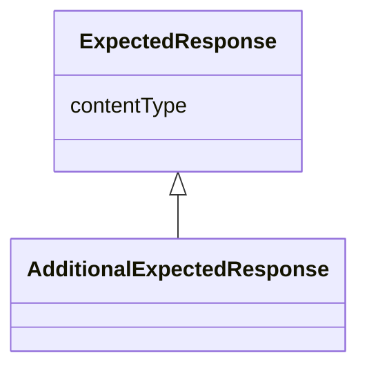

# Class: ExpectedResponse


_Communication metadata describing the expected response message for the primary response._


URI: [hctl:ExpectedResponse](https://www.w3.org/2019/wot/hypermedia#ExpectedResponse)





## Inheritance
* **ExpectedResponse**
    * [AdditionalExpectedResponse](AdditionalExpectedResponse.md)


## Slots

| Name | Cardinality and Range | Description | Inheritance |
| ---  | --- | --- | --- |
| [contentType](contentType.md) | 1 <br/> [String](String.md) | TODO Check, was not in hctl ontology, if not could be source of discrepancy | direct |


## Usages

| used by | used in | type | used |
| ---  | --- | --- | --- |
| [Form](Form.md) | [returns](returns.md) | range | [ExpectedResponse](ExpectedResponse.md) |


## Identifier and Mapping Information


### Schema Source


* from schema: td


## Mappings

| Mapping Type | Mapped Value |
| ---  | ---  |
| self | hctl:ExpectedResponse |
| native | td:ExpectedResponse |


## LinkML Source

<!-- TODO: investigate https://stackoverflow.com/questions/37606292/how-to-create-tabbed-code-blocks-in-mkdocs-or-sphinx -->

### Direct

<details>
```yaml
name: ExpectedResponse
description: Communication metadata describing the expected response message for the
  primary response.
from_schema: td
rank: 1000
attributes:
  contentType:
    name: contentType
    description: TODO Check, was not in hctl ontology, if not could be source of discrepancy
    from_schema: td
    rank: 1000
    domain_of:
    - ExpectedResponse
    - Form
    required: true
class_uri: hctl:ExpectedResponse

```
</details>

### Induced

<details>
```yaml
name: ExpectedResponse
description: Communication metadata describing the expected response message for the
  primary response.
from_schema: td
rank: 1000
attributes:
  contentType:
    name: contentType
    description: TODO Check, was not in hctl ontology, if not could be source of discrepancy
    from_schema: td
    rank: 1000
    alias: contentType
    owner: ExpectedResponse
    domain_of:
    - ExpectedResponse
    - Form
    range: string
    required: true
class_uri: hctl:ExpectedResponse

```
</details>