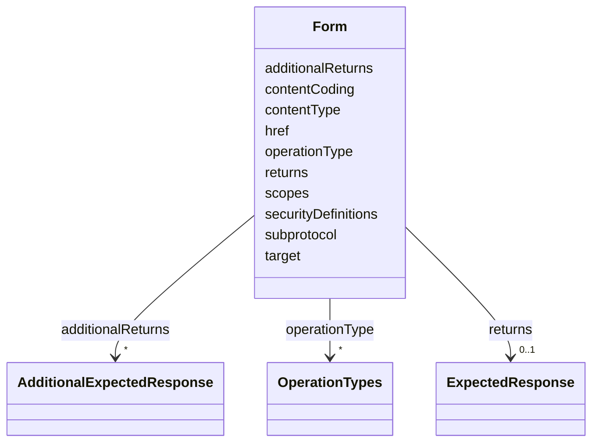

# Class: Form


_A form can be viewed as a statement of to perform an operation type on form context,  make a request method to submission target, where the optional form fields may further describe the required request. In Thing Descriptions, the form context is the surrounding Object,  such as Properties, Actions, and Events or the Thing itself for meta-interactions._


URI: [hctl:Form](https://www.w3.org/2019/wot/hypermedia#Form)





<!-- no inheritance hierarchy -->


## Slots

| Name | Cardinality and Range | Description | Inheritance |
| ---  | --- | --- | --- |
| [target](target.md) | 1 <br/> [AnyUri](AnyUri.md) | Target IRI of a link or submission target of a Form | direct |
| [href](href.md) | 1 <br/> [AnyUri](AnyUri.md) |  | direct |
| [contentType](contentType.md) | 0..1 <br/> [String](String.md) | Assign a content type based on a media type IANA-MEDIA-TYPES (e | direct |
| [contentCoding](contentCoding.md) | 0..1 <br/> [String](String.md) | Content coding values indicate an encoding transformation that has been or ca... | direct |
| [securityDefinitions](securityDefinitions.md) | 0..1 <br/> [String](String.md) | A security schema applied to a (set of) affordance(s) | direct |
| [scopes](scopes.md) | 0..1 <br/> [String](String.md) | TODO Check, was not in hctl ontology, if not could be source of discrepancy | direct |
| [returns](returns.md) | 0..1 <br/> [ExpectedResponse](ExpectedResponse.md) | This optional term can be used if, e | direct |
| [additionalReturns](additionalReturns.md) | * <br/> [AdditionalExpectedResponse](AdditionalExpectedResponse.md) | This optional term can be used if additional expected responses are possible,... | direct |
| [subprotocol](subprotocol.md) | 0..1 <br/> [String](String.md) | Indicates the exact mechanism by which an interaction will be accomplished fo... | direct |
| [operationType](operationType.md) | * <br/> [OperationTypes](OperationTypes.md) | Indicates the semantic intention of performing the operation(s) described by ... | direct |


## Usages

| used by | used in | type | used |
| ---  | --- | --- | --- |
| [InteractionAffordance](InteractionAffordance.md) | [forms](forms.md) | range | [Form](Form.md) |
| [PropertyAffordance](PropertyAffordance.md) | [forms](forms.md) | range | [Form](Form.md) |
| [ActionAffordance](ActionAffordance.md) | [forms](forms.md) | range | [Form](Form.md) |
| [EventAffordance](EventAffordance.md) | [forms](forms.md) | range | [Form](Form.md) |
| [Thing](Thing.md) | [forms](forms.md) | range | [Form](Form.md) |


## Identifier and Mapping Information


### Schema Source


* from schema: td


## Mappings

| Mapping Type | Mapped Value |
| ---  | ---  |
| self | hctl:Form |
| native | td:Form |


## LinkML Source

<!-- TODO: investigate https://stackoverflow.com/questions/37606292/how-to-create-tabbed-code-blocks-in-mkdocs-or-sphinx -->

### Direct

<details>
```yaml
name: Form
description: A form can be viewed as a statement of to perform an operation type on
  form context,  make a request method to submission target, where the optional form
  fields may further describe the required request. In Thing Descriptions, the form
  context is the surrounding Object,  such as Properties, Actions, and Events or the
  Thing itself for meta-interactions.
from_schema: td
rank: 1000
slots:
- target
attributes:
  href:
    name: href
    from_schema: td
    rank: 1000
    domain_of:
    - Form
    range: anyUri
    required: true
  contentType:
    name: contentType
    description: Assign a content type based on a media type IANA-MEDIA-TYPES (e.g.,
      'text/plain') and potential parameters  (e.g., 'charset=utf-8') for the media
      type.
    from_schema: td
    domain_of:
    - ExpectedResponse
    - Form
  contentCoding:
    name: contentCoding
    description: Content coding values indicate an encoding transformation that has
      been or can be applied to a representation.  Content codings are primarily used
      to allow a representation to be compressed or otherwise usefully transformed  without
      losing the identity of its underlying media type and without loss of information.
      Examples of content coding include \"gzip\", \"deflate\", etc.
    from_schema: td
    rank: 1000
    domain_of:
    - Form
  securityDefinitions:
    name: securityDefinitions
    description: A security schema applied to a (set of) affordance(s).
    from_schema: td
    rank: 1000
    domain_of:
    - Form
    - Thing
  scopes:
    name: scopes
    description: TODO Check, was not in hctl ontology, if not could be source of discrepancy
    from_schema: td
    rank: 1000
    domain_of:
    - Form
  returns:
    name: returns
    description: This optional term can be used if, e.g., the output communication
      metadata differ from input metadata (e.g., output contentType differ from the
      input contentType). The response name contains metadata that is only valid for
      the response messages.
    from_schema: td
    rank: 1000
    domain_of:
    - Form
    range: ExpectedResponse
  additionalReturns:
    name: additionalReturns
    description: This optional term can be used if additional expected responses are
      possible, e.g. for error reporting. Each additional response needs to be distinguished
      from others in some way (for example, by specifying a protocol-specific response
      code), and may also have its own data schema.
    from_schema: td
    rank: 1000
    multivalued: true
    domain_of:
    - Form
    range: AdditionalExpectedResponse
  subprotocol:
    name: subprotocol
    description: Indicates the exact mechanism by which an interaction will be accomplished
      for a given protocol when there are multiple options.
    from_schema: td
    rank: 1000
    domain_of:
    - Form
  operationType:
    name: operationType
    description: Indicates the semantic intention of performing the operation(s) described
      by the form.
    from_schema: td
    rank: 1000
    multivalued: true
    domain_of:
    - Form
    range: OperationTypes
class_uri: hctl:Form

```
</details>

### Induced

<details>
```yaml
name: Form
description: A form can be viewed as a statement of to perform an operation type on
  form context,  make a request method to submission target, where the optional form
  fields may further describe the required request. In Thing Descriptions, the form
  context is the surrounding Object,  such as Properties, Actions, and Events or the
  Thing itself for meta-interactions.
from_schema: td
rank: 1000
attributes:
  href:
    name: href
    from_schema: td
    rank: 1000
    alias: href
    owner: Form
    domain_of:
    - Form
    range: anyUri
    required: true
  contentType:
    name: contentType
    description: Assign a content type based on a media type IANA-MEDIA-TYPES (e.g.,
      'text/plain') and potential parameters  (e.g., 'charset=utf-8') for the media
      type.
    from_schema: td
    alias: contentType
    owner: Form
    domain_of:
    - ExpectedResponse
    - Form
    range: string
  contentCoding:
    name: contentCoding
    description: Content coding values indicate an encoding transformation that has
      been or can be applied to a representation.  Content codings are primarily used
      to allow a representation to be compressed or otherwise usefully transformed  without
      losing the identity of its underlying media type and without loss of information.
      Examples of content coding include \"gzip\", \"deflate\", etc.
    from_schema: td
    rank: 1000
    alias: contentCoding
    owner: Form
    domain_of:
    - Form
    range: string
  securityDefinitions:
    name: securityDefinitions
    description: A security schema applied to a (set of) affordance(s).
    from_schema: td
    rank: 1000
    alias: securityDefinitions
    owner: Form
    domain_of:
    - Form
    - Thing
    range: string
  scopes:
    name: scopes
    description: TODO Check, was not in hctl ontology, if not could be source of discrepancy
    from_schema: td
    rank: 1000
    alias: scopes
    owner: Form
    domain_of:
    - Form
    range: string
  returns:
    name: returns
    description: This optional term can be used if, e.g., the output communication
      metadata differ from input metadata (e.g., output contentType differ from the
      input contentType). The response name contains metadata that is only valid for
      the response messages.
    from_schema: td
    rank: 1000
    alias: returns
    owner: Form
    domain_of:
    - Form
    range: ExpectedResponse
  additionalReturns:
    name: additionalReturns
    description: This optional term can be used if additional expected responses are
      possible, e.g. for error reporting. Each additional response needs to be distinguished
      from others in some way (for example, by specifying a protocol-specific response
      code), and may also have its own data schema.
    from_schema: td
    rank: 1000
    multivalued: true
    alias: additionalReturns
    owner: Form
    domain_of:
    - Form
    range: AdditionalExpectedResponse
  subprotocol:
    name: subprotocol
    description: Indicates the exact mechanism by which an interaction will be accomplished
      for a given protocol when there are multiple options.
    from_schema: td
    rank: 1000
    alias: subprotocol
    owner: Form
    domain_of:
    - Form
    range: string
  operationType:
    name: operationType
    description: Indicates the semantic intention of performing the operation(s) described
      by the form.
    from_schema: td
    rank: 1000
    multivalued: true
    alias: operationType
    owner: Form
    domain_of:
    - Form
    range: OperationTypes
  target:
    name: target
    description: Target IRI of a link or submission target of a Form
    from_schema: td
    rank: 1000
    slot_uri: hctl:target
    alias: target
    owner: Form
    domain_of:
    - Link
    - Form
    range: anyUri
    required: true
class_uri: hctl:Form

```
</details>