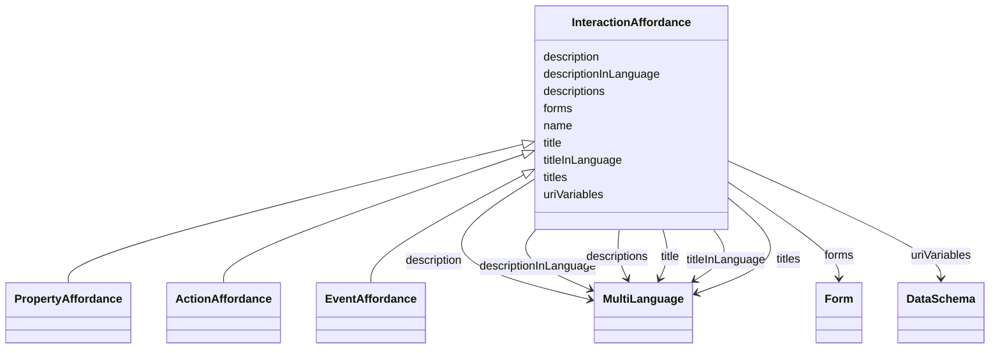

# Class: InteractionAffordance


_TOOD_


URI: [td:InteractionAffordance](https://www.w3.org/2019/wot/td#InteractionAffordance)





## Inheritance
* **InteractionAffordance**
    * [PropertyAffordance](PropertyAffordance.md) [ [DataSchema](DataSchema.md)]
    * [ActionAffordance](ActionAffordance.md)
    * [EventAffordance](EventAffordance.md)


## Slots

| Name | Cardinality and Range | Description | Inheritance |
| ---  | --- | --- | --- |
| [titles](titles.md) | 0..* <br/> [MultiLanguage](MultiLanguage.md) |  | direct |
| [descriptions](descriptions.md) | 0..* <br/> [MultiLanguage](MultiLanguage.md) | TODO, check, according to the description a description should not contain a ... | direct |
| [title](title.md) | 0..1 <br/> [MultiLanguage](MultiLanguage.md) | Provides a human-readable title (e | direct |
| [description](description.md) | 0..1 <br/> [MultiLanguage](MultiLanguage.md) |  | direct |
| [titleInLanguage](titleInLanguage.md) | 0..1 <br/> [MultiLanguage](MultiLanguage.md) | title of the TD element (Thing, interaction affordance, security scheme or da... | direct |
| [descriptionInLanguage](descriptionInLanguage.md) | 0..1 <br/> [MultiLanguage](MultiLanguage.md) | description of the TD element (Thing, interaction affordance, security scheme... | direct |
| [name](name.md) | 1..1 <br/> [String](String.md) | Indexing property to store entity names when serializing them in a JSON-LD @i... | direct |
| [uriVariables](uriVariables.md) | 0..* <br/> [DataSchema](DataSchema.md) | Define URI template variables according to RFC6570 as collection based on sch... | direct |
| [forms](forms.md) | 0..* <br/> [Form](Form.md) | Set of form hypermedia controls that describe how an operation can be perform... | direct |


## Identifier and Mapping Information


### Schema Source


* from schema: td


## Mappings

| Mapping Type | Mapped Value |
| ---  | ---  |
| self | td:InteractionAffordance |
| native | td:InteractionAffordance |


## LinkML Source

<!-- TODO: investigate https://stackoverflow.com/questions/37606292/how-to-create-tabbed-code-blocks-in-mkdocs-or-sphinx -->

### Direct

<details>
```yaml
name: InteractionAffordance
description: TOOD
from_schema: td
slots:
- titles
- descriptions
- title
- description
- titleInLanguage
- descriptionInLanguage
attributes:
  name:
    name: name
    description: Indexing property to store entity names when serializing them in
      a JSON-LD @index container.
    from_schema: td
    rank: 1000
    identifier: true
    domain_of:
    - InteractionAffordance
    required: true
  uriVariables:
    name: uriVariables
    description: 'Define URI template variables according to RFC6570 as collection
      based on schema specifications. The individual variables DataSchema cannot be
      an ObjectSchema or an ArraySchema. TODO: range is not obvious from the ontology.'
    from_schema: td
    rank: 1000
    multivalued: true
    domain_of:
    - InteractionAffordance
    range: DataSchema
  forms:
    name: forms
    description: Set of form hypermedia controls that describe how an operation can
      be performed.
    from_schema: td
    rank: 1000
    multivalued: true
    domain_of:
    - InteractionAffordance
    - Thing
    range: Form
class_uri: td:InteractionAffordance

```
</details>

### Induced

<details>
```yaml
name: InteractionAffordance
description: TOOD
from_schema: td
attributes:
  name:
    name: name
    description: Indexing property to store entity names when serializing them in
      a JSON-LD @index container.
    from_schema: td
    rank: 1000
    identifier: true
    alias: name
    owner: InteractionAffordance
    domain_of:
    - InteractionAffordance
    range: string
    required: true
  uriVariables:
    name: uriVariables
    description: 'Define URI template variables according to RFC6570 as collection
      based on schema specifications. The individual variables DataSchema cannot be
      an ObjectSchema or an ArraySchema. TODO: range is not obvious from the ontology.'
    from_schema: td
    rank: 1000
    multivalued: true
    alias: uriVariables
    owner: InteractionAffordance
    domain_of:
    - InteractionAffordance
    range: DataSchema
  forms:
    name: forms
    description: Set of form hypermedia controls that describe how an operation can
      be performed.
    from_schema: td
    rank: 1000
    multivalued: true
    alias: forms
    owner: InteractionAffordance
    domain_of:
    - InteractionAffordance
    - Thing
    range: Form
  titles:
    name: titles
    from_schema: td
    rank: 1000
    multivalued: true
    alias: titles
    owner: InteractionAffordance
    domain_of:
    - InteractionAffordance
    - Thing
    range: MultiLanguage
    inlined: true
  descriptions:
    name: descriptions
    description: TODO, check, according to the description a description should not
      contain a lang tag.
    from_schema: td
    rank: 1000
    multivalued: true
    alias: descriptions
    owner: InteractionAffordance
    domain_of:
    - SecurityScheme
    - InteractionAffordance
    - Thing
    range: MultiLanguage
    inlined: true
  title:
    name: title
    description: Provides a human-readable title (e.g., display a text for UI representation)
      based on a default language.
    from_schema: td
    rank: 1000
    slot_uri: td:title
    alias: title
    owner: InteractionAffordance
    domain_of:
    - DataSchema
    - InteractionAffordance
    - Thing
    range: MultiLanguage
  description:
    name: description
    from_schema: td
    rank: 1000
    alias: description
    owner: InteractionAffordance
    domain_of:
    - SecurityScheme
    - DataSchema
    - InteractionAffordance
    - Thing
    range: MultiLanguage
  titleInLanguage:
    name: titleInLanguage
    description: title of the TD element (Thing, interaction affordance, security
      scheme or data scheme) with language tag. By convention, a language tag must
      be added to the object of descriptionInLanguage. Otherwise use description.
    from_schema: td
    rank: 1000
    alias: titleInLanguage
    owner: InteractionAffordance
    domain_of:
    - DataSchema
    - InteractionAffordance
    - Thing
    range: MultiLanguage
  descriptionInLanguage:
    name: descriptionInLanguage
    description: description of the TD element (Thing, interaction affordance, security
      scheme or data scheme) with language tag. By convention, a language tag must
      be added to the object of descriptionInLanguage. Otherwise use description.
    from_schema: td
    rank: 1000
    alias: descriptionInLanguage
    owner: InteractionAffordance
    domain_of:
    - DataSchema
    - InteractionAffordance
    - Thing
    range: MultiLanguage
class_uri: td:InteractionAffordance

```
</details>