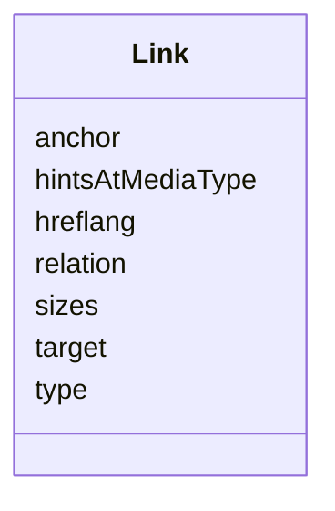

# Class: Link


_A link can be viewed as a statement of the form link context that has a relation type resource at link target", where the optional target attributes may further describe the resource._


URI: [hctl:Link](https://www.w3.org/2019/wot/hypermedia#Link)





<!-- no inheritance hierarchy -->


## Slots

| Name | Cardinality and Range | Description | Inheritance |
| ---  | --- | --- | --- |
| [target](target.md) | 1 <br/> [AnyUri](AnyUri.md) | Target IRI of a link or submission target of a Form | direct |
| [hintsAtMediaType](hintsAtMediaType.md) | 0..1 <br/> [String](String.md) | Target attribute providing a hint indicating what the media type [IANA-MEDIA-... | direct |
| [type](type.md) | 0..1 <br/> [String](String.md) |  | direct |
| [relation](relation.md) | 0..1 <br/> [String](String.md) | A link relation type identifies the semantics of a link | direct |
| [anchor](anchor.md) | 0..1 <br/> [AnyUri](AnyUri.md) | By default, the context, or anchor, of a link conveyed in the Link header fie... | direct |
| [sizes](sizes.md) | 0..1 <br/> [String](String.md) | Target attribute that specifies one or more sizes for the referenced icon | direct |
| [hreflang](hreflang.md) | 0..1 <br/> [String](String.md) | The hreflang attribute specifies the language of a linked document | direct |


## Usages

| used by | used in | type | used |
| ---  | --- | --- | --- |
| [Thing](Thing.md) | [links](links.md) | range | [Link](Link.md) |


## Identifier and Mapping Information


### Schema Source


* from schema: td


## Mappings

| Mapping Type | Mapped Value |
| ---  | ---  |
| self | hctl:Link |
| native | td:Link |


## LinkML Source

<!-- TODO: investigate https://stackoverflow.com/questions/37606292/how-to-create-tabbed-code-blocks-in-mkdocs-or-sphinx -->

### Direct

<details>
```yaml
name: Link
description: A link can be viewed as a statement of the form link context that has
  a relation type resource at link target", where the optional target attributes may
  further describe the resource.
from_schema: td
rank: 1000
slots:
- target
attributes:
  hintsAtMediaType:
    name: hintsAtMediaType
    description: Target attribute providing a hint indicating what the media type
      [IANA-MEDIA-TYPES] of the result of dereferencing the link should be.
    from_schema: td
    rank: 1000
    domain_of:
    - Link
  type:
    name: type
    from_schema: td
    rank: 1000
    domain_of:
    - Link
  relation:
    name: relation
    description: A link relation type identifies the semantics of a link.
    from_schema: td
    rank: 1000
    domain_of:
    - Link
  anchor:
    name: anchor
    description: By default, the context, or anchor, of a link conveyed in the Link
      header field is the URL of the representation it is associated with, as defined
      in RFC7231, Section 3.1.4.1, and is serialized as a URI.
    from_schema: td
    rank: 1000
    domain_of:
    - Link
    range: anyUri
  sizes:
    name: sizes
    description: Target attribute that specifies one or more sizes for the referenced
      icon. Only applicable for relation type 'icon'. The value pattern follows {Height}x{Width}
      (e.g., \"16x16\", \"16x16 32x32\").
    from_schema: td
    rank: 1000
    domain_of:
    - Link
  hreflang:
    name: hreflang
    description: The hreflang attribute specifies the language of a linked document.
      The value of this must be a valid language tag [[BCP47]].
    from_schema: td
    rank: 1000
    domain_of:
    - Link
    pattern: ^(((([A-Za-z]{2,3}(-([A-Za-z]{3}(-[A-Za-z]{3}){0,2}))?)|[A-Za-z]{4}|[A-Za-z]{5,8})(-([A-Za-z]{4}))?(-([A-Za-z]{2}|[0-9]{3}))?(-([A-Za-z0-9]{5,8}|[0-9][A-Za-z0-9]{3}))*(-([0-9A-WY-Za-wy-z](-[A-Za-z0-9]{2,8})+))*(-(x(-[A-Za-z0-9]{1,8})+))?)|(x(-[A-Za-z0-9]{1,8})+)|((en-GB-oed|i-ami|i-bnn|i-default|i-enochian|i-hak|i-klingon|i-lux|i-mingo|i-navajo|i-pwn|i-tao|i-tay|i-tsu|sgn-BE-FR|sgn-BE-NL|sgn-CH-DE)|(art-lojban|cel-gaulish|no-bok|no-nyn|zh-guoyu|zh-hakka|zh-min|zh-min-nan|zh-xiang)))$
class_uri: hctl:Link

```
</details>

### Induced

<details>
```yaml
name: Link
description: A link can be viewed as a statement of the form link context that has
  a relation type resource at link target", where the optional target attributes may
  further describe the resource.
from_schema: td
rank: 1000
attributes:
  hintsAtMediaType:
    name: hintsAtMediaType
    description: Target attribute providing a hint indicating what the media type
      [IANA-MEDIA-TYPES] of the result of dereferencing the link should be.
    from_schema: td
    rank: 1000
    alias: hintsAtMediaType
    owner: Link
    domain_of:
    - Link
    range: string
  type:
    name: type
    from_schema: td
    rank: 1000
    alias: type
    owner: Link
    domain_of:
    - Link
    range: string
  relation:
    name: relation
    description: A link relation type identifies the semantics of a link.
    from_schema: td
    rank: 1000
    alias: relation
    owner: Link
    domain_of:
    - Link
    range: string
  anchor:
    name: anchor
    description: By default, the context, or anchor, of a link conveyed in the Link
      header field is the URL of the representation it is associated with, as defined
      in RFC7231, Section 3.1.4.1, and is serialized as a URI.
    from_schema: td
    rank: 1000
    alias: anchor
    owner: Link
    domain_of:
    - Link
    range: anyUri
  sizes:
    name: sizes
    description: Target attribute that specifies one or more sizes for the referenced
      icon. Only applicable for relation type 'icon'. The value pattern follows {Height}x{Width}
      (e.g., \"16x16\", \"16x16 32x32\").
    from_schema: td
    rank: 1000
    alias: sizes
    owner: Link
    domain_of:
    - Link
    range: string
  hreflang:
    name: hreflang
    description: The hreflang attribute specifies the language of a linked document.
      The value of this must be a valid language tag [[BCP47]].
    from_schema: td
    rank: 1000
    alias: hreflang
    owner: Link
    domain_of:
    - Link
    range: string
    pattern: ^(((([A-Za-z]{2,3}(-([A-Za-z]{3}(-[A-Za-z]{3}){0,2}))?)|[A-Za-z]{4}|[A-Za-z]{5,8})(-([A-Za-z]{4}))?(-([A-Za-z]{2}|[0-9]{3}))?(-([A-Za-z0-9]{5,8}|[0-9][A-Za-z0-9]{3}))*(-([0-9A-WY-Za-wy-z](-[A-Za-z0-9]{2,8})+))*(-(x(-[A-Za-z0-9]{1,8})+))?)|(x(-[A-Za-z0-9]{1,8})+)|((en-GB-oed|i-ami|i-bnn|i-default|i-enochian|i-hak|i-klingon|i-lux|i-mingo|i-navajo|i-pwn|i-tao|i-tay|i-tsu|sgn-BE-FR|sgn-BE-NL|sgn-CH-DE)|(art-lojban|cel-gaulish|no-bok|no-nyn|zh-guoyu|zh-hakka|zh-min|zh-min-nan|zh-xiang)))$
  target:
    name: target
    description: Target IRI of a link or submission target of a Form
    from_schema: td
    rank: 1000
    slot_uri: hctl:target
    alias: target
    owner: Link
    domain_of:
    - Link
    - Form
    range: anyUri
    required: true
class_uri: hctl:Link

```
</details>