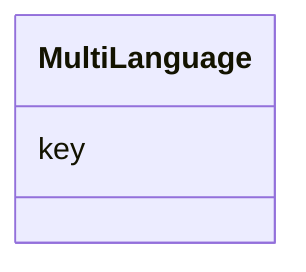

# Class: MultiLanguage


URI: [td:MultiLanguage](https://www.w3.org/2019/wot/td#MultiLanguage)





<!-- no inheritance hierarchy -->


## Slots

| Name | Cardinality and Range | Description | Inheritance |
| ---  | --- | --- | --- |
| [key](key.md) | 1..1 <br/> [String](String.md) |  | direct |


## Usages

| used by | used in | type | used |
| ---  | --- | --- | --- |
| [SecurityScheme](SecurityScheme.md) | [descriptions](descriptions.md) | range | [MultiLanguage](MultiLanguage.md) |
| [DataSchema](DataSchema.md) | [description](description.md) | range | [MultiLanguage](MultiLanguage.md) |
| [DataSchema](DataSchema.md) | [title](title.md) | range | [MultiLanguage](MultiLanguage.md) |
| [DataSchema](DataSchema.md) | [titleInLanguage](titleInLanguage.md) | range | [MultiLanguage](MultiLanguage.md) |
| [DataSchema](DataSchema.md) | [descriptionInLanguage](descriptionInLanguage.md) | range | [MultiLanguage](MultiLanguage.md) |
| [InteractionAffordance](InteractionAffordance.md) | [titles](titles.md) | range | [MultiLanguage](MultiLanguage.md) |
| [InteractionAffordance](InteractionAffordance.md) | [descriptions](descriptions.md) | range | [MultiLanguage](MultiLanguage.md) |
| [InteractionAffordance](InteractionAffordance.md) | [title](title.md) | range | [MultiLanguage](MultiLanguage.md) |
| [InteractionAffordance](InteractionAffordance.md) | [description](description.md) | range | [MultiLanguage](MultiLanguage.md) |
| [InteractionAffordance](InteractionAffordance.md) | [titleInLanguage](titleInLanguage.md) | range | [MultiLanguage](MultiLanguage.md) |
| [InteractionAffordance](InteractionAffordance.md) | [descriptionInLanguage](descriptionInLanguage.md) | range | [MultiLanguage](MultiLanguage.md) |
| [PropertyAffordance](PropertyAffordance.md) | [description](description.md) | range | [MultiLanguage](MultiLanguage.md) |
| [PropertyAffordance](PropertyAffordance.md) | [title](title.md) | range | [MultiLanguage](MultiLanguage.md) |
| [PropertyAffordance](PropertyAffordance.md) | [titleInLanguage](titleInLanguage.md) | range | [MultiLanguage](MultiLanguage.md) |
| [PropertyAffordance](PropertyAffordance.md) | [descriptionInLanguage](descriptionInLanguage.md) | range | [MultiLanguage](MultiLanguage.md) |
| [PropertyAffordance](PropertyAffordance.md) | [titles](titles.md) | range | [MultiLanguage](MultiLanguage.md) |
| [PropertyAffordance](PropertyAffordance.md) | [descriptions](descriptions.md) | range | [MultiLanguage](MultiLanguage.md) |
| [ActionAffordance](ActionAffordance.md) | [titles](titles.md) | range | [MultiLanguage](MultiLanguage.md) |
| [ActionAffordance](ActionAffordance.md) | [descriptions](descriptions.md) | range | [MultiLanguage](MultiLanguage.md) |
| [ActionAffordance](ActionAffordance.md) | [title](title.md) | range | [MultiLanguage](MultiLanguage.md) |
| [ActionAffordance](ActionAffordance.md) | [description](description.md) | range | [MultiLanguage](MultiLanguage.md) |
| [ActionAffordance](ActionAffordance.md) | [titleInLanguage](titleInLanguage.md) | range | [MultiLanguage](MultiLanguage.md) |
| [ActionAffordance](ActionAffordance.md) | [descriptionInLanguage](descriptionInLanguage.md) | range | [MultiLanguage](MultiLanguage.md) |
| [EventAffordance](EventAffordance.md) | [titles](titles.md) | range | [MultiLanguage](MultiLanguage.md) |
| [EventAffordance](EventAffordance.md) | [descriptions](descriptions.md) | range | [MultiLanguage](MultiLanguage.md) |
| [EventAffordance](EventAffordance.md) | [title](title.md) | range | [MultiLanguage](MultiLanguage.md) |
| [EventAffordance](EventAffordance.md) | [description](description.md) | range | [MultiLanguage](MultiLanguage.md) |
| [EventAffordance](EventAffordance.md) | [titleInLanguage](titleInLanguage.md) | range | [MultiLanguage](MultiLanguage.md) |
| [EventAffordance](EventAffordance.md) | [descriptionInLanguage](descriptionInLanguage.md) | range | [MultiLanguage](MultiLanguage.md) |
| [Thing](Thing.md) | [title](title.md) | range | [MultiLanguage](MultiLanguage.md) |
| [Thing](Thing.md) | [description](description.md) | range | [MultiLanguage](MultiLanguage.md) |
| [Thing](Thing.md) | [titles](titles.md) | range | [MultiLanguage](MultiLanguage.md) |
| [Thing](Thing.md) | [descriptions](descriptions.md) | range | [MultiLanguage](MultiLanguage.md) |
| [Thing](Thing.md) | [titleInLanguage](titleInLanguage.md) | range | [MultiLanguage](MultiLanguage.md) |
| [Thing](Thing.md) | [descriptionInLanguage](descriptionInLanguage.md) | range | [MultiLanguage](MultiLanguage.md) |


## Identifier and Mapping Information


### Schema Source


* from schema: td


## Mappings

| Mapping Type | Mapped Value |
| ---  | ---  |
| self | td:MultiLanguage |
| native | td:MultiLanguage |


## LinkML Source

<!-- TODO: investigate https://stackoverflow.com/questions/37606292/how-to-create-tabbed-code-blocks-in-mkdocs-or-sphinx -->

### Direct

<details>
```yaml
name: MultiLanguage
from_schema: td
attributes:
  key:
    name: key
    from_schema: td
    rank: 1000
    identifier: true
    domain_of:
    - MultiLanguage
    required: true
    pattern: ^(((([A-Za-z]{2,3}(-([A-Za-z]{3}(-[A-Za-z]{3}){0,2}))?)|[A-Za-z]{4}|[A-Za-z]{5,8})(-([A-Za-z]{4}))?(-([A-Za-z]{2}|[0-9]{3}))?(-([A-Za-z0-9]{5,8}|[0-9][A-Za-z0-9]{3}))*(-([0-9A-WY-Za-wy-z](-[A-Za-z0-9]{2,8})+))*(-(x(-[A-Za-z0-9]{1,8})+))?)|(x(-[A-Za-z0-9]{1,8})+)|((en-GB-oed|i-ami|i-bnn|i-default|i-enochian|i-hak|i-klingon|i-lux|i-mingo|i-navajo|i-pwn|i-tao|i-tay|i-tsu|sgn-BE-FR|sgn-BE-NL|sgn-CH-DE)|(art-lojban|cel-gaulish|no-bok|no-nyn|zh-guoyu|zh-hakka|zh-min|zh-min-nan|zh-xiang)))$

```
</details>

### Induced

<details>
```yaml
name: MultiLanguage
from_schema: td
attributes:
  key:
    name: key
    from_schema: td
    rank: 1000
    identifier: true
    alias: key
    owner: MultiLanguage
    domain_of:
    - MultiLanguage
    range: string
    required: true
    pattern: ^(((([A-Za-z]{2,3}(-([A-Za-z]{3}(-[A-Za-z]{3}){0,2}))?)|[A-Za-z]{4}|[A-Za-z]{5,8})(-([A-Za-z]{4}))?(-([A-Za-z]{2}|[0-9]{3}))?(-([A-Za-z0-9]{5,8}|[0-9][A-Za-z0-9]{3}))*(-([0-9A-WY-Za-wy-z](-[A-Za-z0-9]{2,8})+))*(-(x(-[A-Za-z0-9]{1,8})+))?)|(x(-[A-Za-z0-9]{1,8})+)|((en-GB-oed|i-ami|i-bnn|i-default|i-enochian|i-hak|i-klingon|i-lux|i-mingo|i-navajo|i-pwn|i-tao|i-tay|i-tsu|sgn-BE-FR|sgn-BE-NL|sgn-CH-DE)|(art-lojban|cel-gaulish|no-bok|no-nyn|zh-guoyu|zh-hakka|zh-min|zh-min-nan|zh-xiang)))$

```
</details>