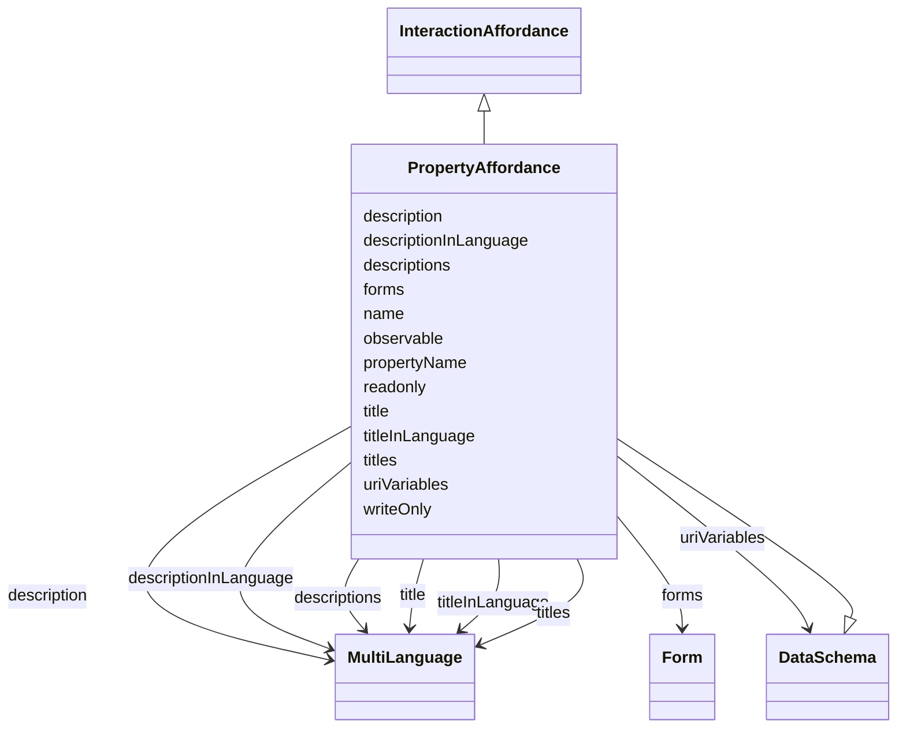

# Class: PropertyAffordance


_An Interaction Affordance that exposes state of the Thing. This state can be retrieved (read) and/or updated._


URI: [td:PropertyAffordance](https://www.w3.org/2019/wot/td#PropertyAffordance)





## Inheritance
* [InteractionAffordance](InteractionAffordance.md)
    * **PropertyAffordance** [ [DataSchema](DataSchema.md)]


## Slots

| Name | Cardinality and Range | Description | Inheritance |
| ---  | --- | --- | --- |
| [observable](observable.md) | 0..1 <br/> [Boolean](Boolean.md) | A hint that indicates whether Servients hosting the Thing and Intermediaries ... | direct |
| [description](description.md) | 0..1 <br/> [MultiLanguage](MultiLanguage.md) |  | [DataSchema](DataSchema.md), [InteractionAffordance](InteractionAffordance.md) |
| [title](title.md) | 0..1 <br/> [MultiLanguage](MultiLanguage.md) | Provides a human-readable title (e | [DataSchema](DataSchema.md), [InteractionAffordance](InteractionAffordance.md) |
| [titleInLanguage](titleInLanguage.md) | 0..1 <br/> [MultiLanguage](MultiLanguage.md) | title of the TD element (Thing, interaction affordance, security scheme or da... | [DataSchema](DataSchema.md), [InteractionAffordance](InteractionAffordance.md) |
| [descriptionInLanguage](descriptionInLanguage.md) | 0..1 <br/> [MultiLanguage](MultiLanguage.md) | description of the TD element (Thing, interaction affordance, security scheme... | [DataSchema](DataSchema.md), [InteractionAffordance](InteractionAffordance.md) |
| [propertyName](propertyName.md) | 0..1 <br/> [String](String.md) | Used to store the indexing name in the parent object when this schema appears... | [DataSchema](DataSchema.md) |
| [writeOnly](writeOnly.md) | 0..1 <br/> [String](String.md) | Boolean value that is a hint to indicate whether a property interaction/value... | [DataSchema](DataSchema.md) |
| [readonly](readonly.md) | 0..1 <br/> [String](String.md) | Boolean value that is a hint to indicate whether a property interaction/value... | [DataSchema](DataSchema.md) |
| [titles](titles.md) | 0..* <br/> [MultiLanguage](MultiLanguage.md) |  | [InteractionAffordance](InteractionAffordance.md) |
| [descriptions](descriptions.md) | 0..* <br/> [MultiLanguage](MultiLanguage.md) | TODO, check, according to the description a description should not contain a ... | [InteractionAffordance](InteractionAffordance.md) |
| [name](name.md) | 1..1 <br/> [String](String.md) | Indexing property to store entity names when serializing them in a JSON-LD @i... | [InteractionAffordance](InteractionAffordance.md) |
| [uriVariables](uriVariables.md) | 0..* <br/> [DataSchema](DataSchema.md) | Define URI template variables according to RFC6570 as collection based on sch... | [InteractionAffordance](InteractionAffordance.md) |
| [forms](forms.md) | 0..* <br/> [Form](Form.md) | Set of form hypermedia controls that describe how an operation can be perform... | [InteractionAffordance](InteractionAffordance.md) |


## Usages

| used by | used in | type | used |
| ---  | --- | --- | --- |
| [Thing](Thing.md) | [properties](properties.md) | range | [PropertyAffordance](PropertyAffordance.md) |


## Identifier and Mapping Information


### Schema Source


* from schema: td


## Mappings

| Mapping Type | Mapped Value |
| ---  | ---  |
| self | td:PropertyAffordance |
| native | td:PropertyAffordance |


## LinkML Source

<!-- TODO: investigate https://stackoverflow.com/questions/37606292/how-to-create-tabbed-code-blocks-in-mkdocs-or-sphinx -->

### Direct

<details>
```yaml
name: PropertyAffordance
description: An Interaction Affordance that exposes state of the Thing. This state
  can be retrieved (read) and/or updated.
from_schema: td
is_a: InteractionAffordance
mixins:
- DataSchema
attributes:
  observable:
    name: observable
    description: A hint that indicates whether Servients hosting the Thing and Intermediaries
      should probide a Protocol Binding  that supports the observeproperty and unobserveproperty
      operations for this Property.
    from_schema: td
    rank: 1000
    domain_of:
    - PropertyAffordance
    range: boolean
class_uri: td:PropertyAffordance

```
</details>

### Induced

<details>
```yaml
name: PropertyAffordance
description: An Interaction Affordance that exposes state of the Thing. This state
  can be retrieved (read) and/or updated.
from_schema: td
is_a: InteractionAffordance
mixins:
- DataSchema
attributes:
  observable:
    name: observable
    description: A hint that indicates whether Servients hosting the Thing and Intermediaries
      should probide a Protocol Binding  that supports the observeproperty and unobserveproperty
      operations for this Property.
    from_schema: td
    rank: 1000
    alias: observable
    owner: PropertyAffordance
    domain_of:
    - PropertyAffordance
    range: boolean
  description:
    name: description
    from_schema: td
    rank: 1000
    alias: description
    owner: PropertyAffordance
    domain_of:
    - SecurityScheme
    - DataSchema
    - InteractionAffordance
    - Thing
    range: MultiLanguage
  title:
    name: title
    description: Provides a human-readable title (e.g., display a text for UI representation)
      based on a default language.
    from_schema: td
    rank: 1000
    slot_uri: td:title
    alias: title
    owner: PropertyAffordance
    domain_of:
    - DataSchema
    - InteractionAffordance
    - Thing
    range: MultiLanguage
  titleInLanguage:
    name: titleInLanguage
    description: title of the TD element (Thing, interaction affordance, security
      scheme or data scheme) with language tag. By convention, a language tag must
      be added to the object of descriptionInLanguage. Otherwise use description.
    from_schema: td
    rank: 1000
    alias: titleInLanguage
    owner: PropertyAffordance
    domain_of:
    - DataSchema
    - InteractionAffordance
    - Thing
    range: MultiLanguage
  descriptionInLanguage:
    name: descriptionInLanguage
    description: description of the TD element (Thing, interaction affordance, security
      scheme or data scheme) with language tag. By convention, a language tag must
      be added to the object of descriptionInLanguage. Otherwise use description.
    from_schema: td
    rank: 1000
    alias: descriptionInLanguage
    owner: PropertyAffordance
    domain_of:
    - DataSchema
    - InteractionAffordance
    - Thing
    range: MultiLanguage
  propertyName:
    name: propertyName
    description: Used to store the indexing name in the parent object when this schema
      appears as a property of an object schema.
    from_schema: td
    rank: 1000
    alias: propertyName
    owner: PropertyAffordance
    domain_of:
    - DataSchema
    range: string
  writeOnly:
    name: writeOnly
    description: Boolean value that is a hint to indicate whether a property interaction/value
      is write only (=true) or not (=false).
    from_schema: td
    rank: 1000
    alias: writeOnly
    owner: PropertyAffordance
    domain_of:
    - DataSchema
    range: string
  readonly:
    name: readonly
    description: Boolean value that is a hint to indicate whether a property interaction/value
      is read only (=true) or not (=false).
    from_schema: td
    rank: 1000
    alias: readonly
    owner: PropertyAffordance
    domain_of:
    - DataSchema
    range: string
  titles:
    name: titles
    from_schema: td
    rank: 1000
    multivalued: true
    alias: titles
    owner: PropertyAffordance
    domain_of:
    - InteractionAffordance
    - Thing
    range: MultiLanguage
    inlined: true
  descriptions:
    name: descriptions
    description: TODO, check, according to the description a description should not
      contain a lang tag.
    from_schema: td
    rank: 1000
    multivalued: true
    alias: descriptions
    owner: PropertyAffordance
    domain_of:
    - SecurityScheme
    - InteractionAffordance
    - Thing
    range: MultiLanguage
    inlined: true
  name:
    name: name
    description: Indexing property to store entity names when serializing them in
      a JSON-LD @index container.
    from_schema: td
    rank: 1000
    identifier: true
    alias: name
    owner: PropertyAffordance
    domain_of:
    - InteractionAffordance
    range: string
    required: true
  uriVariables:
    name: uriVariables
    description: 'Define URI template variables according to RFC6570 as collection
      based on schema specifications. The individual variables DataSchema cannot be
      an ObjectSchema or an ArraySchema. TODO: range is not obvious from the ontology.'
    from_schema: td
    rank: 1000
    multivalued: true
    alias: uriVariables
    owner: PropertyAffordance
    domain_of:
    - InteractionAffordance
    range: DataSchema
  forms:
    name: forms
    description: Set of form hypermedia controls that describe how an operation can
      be performed.
    from_schema: td
    rank: 1000
    multivalued: true
    alias: forms
    owner: PropertyAffordance
    domain_of:
    - InteractionAffordance
    - Thing
    range: Form
class_uri: td:PropertyAffordance

```
</details>