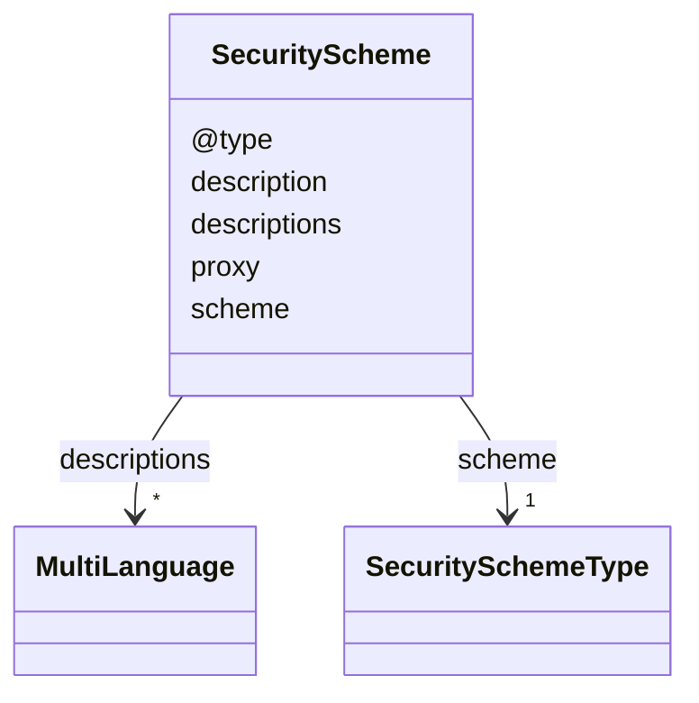

# Class: SecurityScheme


URI: [td:SecurityScheme](https://www.w3.org/2019/wot/td#SecurityScheme)





<!-- no inheritance hierarchy -->


## Slots

| Name | Cardinality and Range | Description | Inheritance |
| ---  | --- | --- | --- |
| [@type](@type.md) | * <br/> [String](String.md) |  | direct |
| [descriptions](descriptions.md) | * <br/> [MultiLanguage](MultiLanguage.md) | TODO, check, according to the description a description should not contain a ... | direct |
| [description](description.md) | 0..1 <br/> [String](String.md) |  | direct |
| [proxy](proxy.md) | 0..1 <br/> [AnyUri](AnyUri.md) | URI of the proxy server this security configuration provides access to | direct |
| [scheme](scheme.md) | 1 <br/> [SecuritySchemeType](SecuritySchemeType.md) |  | direct |


## Identifier and Mapping Information


### Schema Source


* from schema: td


## Mappings

| Mapping Type | Mapped Value |
| ---  | ---  |
| self | td:SecurityScheme |
| native | td:SecurityScheme |


## LinkML Source

<!-- TODO: investigate https://stackoverflow.com/questions/37606292/how-to-create-tabbed-code-blocks-in-mkdocs-or-sphinx -->

### Direct

<details>
```yaml
name: SecurityScheme
from_schema: td
rank: 1000
slots:
- '@type'
- descriptions
attributes:
  description:
    name: description
    from_schema: td
    domain_of:
    - SecurityScheme
    - DataSchema
    - InteractionAffordance
    - Thing
  proxy:
    name: proxy
    description: URI of the proxy server this security configuration provides access
      to. If not given, the corresponding security configuration is for the endpoint.
    from_schema: td
    rank: 1000
    domain_of:
    - SecurityScheme
    range: anyUri
  scheme:
    name: scheme
    from_schema: td
    rank: 1000
    domain_of:
    - SecurityScheme
    range: SecuritySchemeType
    required: true

```
</details>

### Induced

<details>
```yaml
name: SecurityScheme
from_schema: td
rank: 1000
attributes:
  description:
    name: description
    from_schema: td
    alias: description
    owner: SecurityScheme
    domain_of:
    - SecurityScheme
    - DataSchema
    - InteractionAffordance
    - Thing
    range: string
  proxy:
    name: proxy
    description: URI of the proxy server this security configuration provides access
      to. If not given, the corresponding security configuration is for the endpoint.
    from_schema: td
    rank: 1000
    alias: proxy
    owner: SecurityScheme
    domain_of:
    - SecurityScheme
    range: anyUri
  scheme:
    name: scheme
    from_schema: td
    rank: 1000
    alias: scheme
    owner: SecurityScheme
    domain_of:
    - SecurityScheme
    range: SecuritySchemeType
    required: true
  '@type':
    name: '@type'
    from_schema: td
    rank: 1000
    multivalued: true
    alias: '@type'
    owner: SecurityScheme
    domain_of:
    - SecurityScheme
    - Thing
    range: string
  descriptions:
    name: descriptions
    description: TODO, check, according to the description a description should not
      contain a lang tag.
    from_schema: td
    rank: 1000
    multivalued: true
    alias: descriptions
    owner: SecurityScheme
    domain_of:
    - SecurityScheme
    - InteractionAffordance
    - Thing
    range: MultiLanguage
    inlined: true

```
</details>