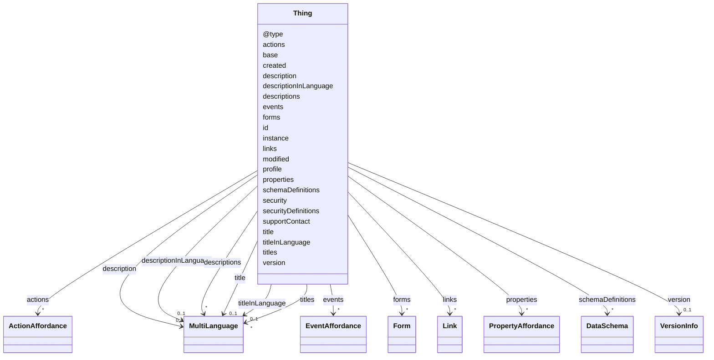

# Class: Thing


_An abstraction of a physical or a virtual entity whose metadata and interfaces are described by a WoT Thing Description, whereas a virtual entity is the composition of one or more Things._


URI: [td:Thing](https://www.w3.org/2019/wot/td#Thing)





<!-- no inheritance hierarchy -->


## Slots

| Name | Cardinality and Range | Description | Inheritance |
| ---  | --- | --- | --- |
| [id](id.md) | 1 <br/> [AnyUri](AnyUri.md) | TODO | direct |
| [title](title.md) | 0..1 <br/> [MultiLanguage](MultiLanguage.md) | Provides a human-readable title (e | direct |
| [description](description.md) | 0..1 <br/> [MultiLanguage](MultiLanguage.md) |  | direct |
| [titles](titles.md) | * <br/> [MultiLanguage](MultiLanguage.md) |  | direct |
| [descriptions](descriptions.md) | * <br/> [MultiLanguage](MultiLanguage.md) | TODO, check, according to the description a description should not contain a ... | direct |
| [@type](@type.md) | * <br/> [String](String.md) |  | direct |
| [titleInLanguage](titleInLanguage.md) | 0..1 <br/> [MultiLanguage](MultiLanguage.md) | title of the TD element (Thing, interaction affordance, security scheme or da... | direct |
| [descriptionInLanguage](descriptionInLanguage.md) | 0..1 <br/> [MultiLanguage](MultiLanguage.md) | description of the TD element (Thing, interaction affordance, security scheme... | direct |
| [securityDefinitions](securityDefinitions.md) | * <br/> [String](String.md)&nbsp;or&nbsp;<br />[String](String.md)&nbsp;or&nbsp;<br />[SecuritySchemeType](SecuritySchemeType.md) | A security scheme applied to a (set of) affordance(s) | direct |
| [security](security.md) | * <br/> [String](String.md) | A Thing may define abstract security schemes, used to configure the secure ac... | direct |
| [schemaDefinitions](schemaDefinitions.md) | * <br/> [DataSchema](DataSchema.md) | TODO CHECK | direct |
| [profile](profile.md) | * <br/> [AnyUri](AnyUri.md) | Indicates the WoT Profile mechanisms followed by this Thing Description and t... | direct |
| [instance](instance.md) | 0..1 <br/> [String](String.md) | Provides a version identicator of this TD instance | direct |
| [created](created.md) | 0..1 <br/> [Datetime](Datetime.md) | Provides information when the TD instance was created | direct |
| [modified](modified.md) | 0..1 <br/> [Datetime](Datetime.md) | Provides information when the TD instance was last modified | direct |
| [supportContact](supportContact.md) | 0..1 <br/> [AnyUri](AnyUri.md) | Provides information about the TD maintainer as URI scheme (e | direct |
| [base](base.md) | 0..1 <br/> [AnyUri](AnyUri.md) | Define the base URI that is used for all relative URI references throughout a... | direct |
| [version](version.md) | 0..1 <br/> [VersionInfo](VersionInfo.md) |  | direct |
| [forms](forms.md) | * <br/> [Form](Form.md) | Set of form hypermedia controls that describe how an operation can be perform... | direct |
| [links](links.md) | * <br/> [Link](Link.md) | Provides Web links to arbitrary resources that relate to the specified Thing ... | direct |
| [properties](properties.md) | * <br/> [PropertyAffordance](PropertyAffordance.md) | All Property-based interaction affordances of the Thing | direct |
| [actions](actions.md) | * <br/> [ActionAffordance](ActionAffordance.md) | All Action-based interaction affordances of the Thing | direct |
| [events](events.md) | * <br/> [EventAffordance](EventAffordance.md) | All Event-based interaction affordances of the Thing | direct |


## Identifier and Mapping Information


### Schema Source


* from schema: td


## Mappings

| Mapping Type | Mapped Value |
| ---  | ---  |
| self | td:Thing |
| native | td:Thing |


## LinkML Source

<!-- TODO: investigate https://stackoverflow.com/questions/37606292/how-to-create-tabbed-code-blocks-in-mkdocs-or-sphinx -->

### Direct

<details>
```yaml
name: Thing
description: An abstraction of a physical or a virtual entity whose metadata and interfaces
  are described by a WoT Thing Description, whereas a virtual entity is the composition
  of one or more Things.
from_schema: td
rank: 1000
slots:
- id
- title
- description
- titles
- descriptions
- '@type'
- titleInLanguage
- descriptionInLanguage
attributes:
  securityDefinitions:
    name: securityDefinitions
    description: A security scheme applied to a (set of) affordance(s). TODO check
    from_schema: td
    multivalued: true
    domain_of:
    - Form
    - Thing
    any_of:
    - range: string
    - range: SecuritySchemeType
  security:
    name: security
    description: 'A Thing may define abstract security schemes, used to configure
      the secure access of (a set of) affordance(s). TODO: check'
    from_schema: td
    rank: 1000
    multivalued: true
    domain_of:
    - Thing
  schemaDefinitions:
    name: schemaDefinitions
    description: TODO CHECK
    from_schema: td
    rank: 1000
    multivalued: true
    domain_of:
    - Thing
    range: DataSchema
  profile:
    name: profile
    description: Indicates the WoT Profile mechanisms followed by this Thing Description
      and the corresponding Thing implementation.
    from_schema: td
    rank: 1000
    multivalued: true
    domain_of:
    - Thing
    range: anyUri
  instance:
    name: instance
    description: Provides a version identicator of this TD instance.
    from_schema: td
    domain_of:
    - VersionInfo
    - Thing
  created:
    name: created
    description: Provides information when the TD instance was created.
    from_schema: td
    rank: 1000
    domain_of:
    - Thing
    range: datetime
  modified:
    name: modified
    description: Provides information when the TD instance was last modified.
    from_schema: td
    rank: 1000
    domain_of:
    - Thing
    range: datetime
  supportContact:
    name: supportContact
    description: Provides information about the TD maintainer as URI scheme (e.g.,
      <code>mailto</code> [[RFC6068]],<code>tel</code> [[RFC3966]],<code>https</code>
      [[RFC9112]]).
    from_schema: td
    rank: 1000
    domain_of:
    - Thing
    range: anyUri
  base:
    name: base
    description: Define the base URI that is used for all relative URI references
      throughout a TD document.
    from_schema: td
    rank: 1000
    domain_of:
    - Thing
    range: anyUri
  version:
    name: version
    from_schema: td
    rank: 1000
    domain_of:
    - Thing
    range: VersionInfo
  forms:
    name: forms
    description: Set of form hypermedia controls that describe how an operation can
      be performed. Forms are serializations of Protocol Bindings.
    from_schema: td
    multivalued: true
    domain_of:
    - InteractionAffordance
    - Thing
    range: Form
  links:
    name: links
    description: Provides Web links to arbitrary resources that relate to the specified
      Thing Description.
    from_schema: td
    rank: 1000
    multivalued: true
    domain_of:
    - Thing
    range: Link
  properties:
    name: properties
    description: All Property-based interaction affordances of the Thing.
    from_schema: td
    rank: 1000
    multivalued: true
    domain_of:
    - Thing
    range: PropertyAffordance
    inlined: true
  actions:
    name: actions
    description: All Action-based interaction affordances of the Thing.
    from_schema: td
    rank: 1000
    multivalued: true
    domain_of:
    - Thing
    range: ActionAffordance
    inlined: true
  events:
    name: events
    description: All Event-based interaction affordances of the Thing.
    from_schema: td
    rank: 1000
    multivalued: true
    domain_of:
    - Thing
    range: EventAffordance
    inlined: true
class_uri: td:Thing

```
</details>

### Induced

<details>
```yaml
name: Thing
description: An abstraction of a physical or a virtual entity whose metadata and interfaces
  are described by a WoT Thing Description, whereas a virtual entity is the composition
  of one or more Things.
from_schema: td
rank: 1000
attributes:
  securityDefinitions:
    name: securityDefinitions
    description: A security scheme applied to a (set of) affordance(s). TODO check
    from_schema: td
    multivalued: true
    alias: securityDefinitions
    owner: Thing
    domain_of:
    - Form
    - Thing
    range: string
    any_of:
    - range: string
    - range: SecuritySchemeType
  security:
    name: security
    description: 'A Thing may define abstract security schemes, used to configure
      the secure access of (a set of) affordance(s). TODO: check'
    from_schema: td
    rank: 1000
    multivalued: true
    alias: security
    owner: Thing
    domain_of:
    - Thing
    range: string
  schemaDefinitions:
    name: schemaDefinitions
    description: TODO CHECK
    from_schema: td
    rank: 1000
    multivalued: true
    alias: schemaDefinitions
    owner: Thing
    domain_of:
    - Thing
    range: DataSchema
  profile:
    name: profile
    description: Indicates the WoT Profile mechanisms followed by this Thing Description
      and the corresponding Thing implementation.
    from_schema: td
    rank: 1000
    multivalued: true
    alias: profile
    owner: Thing
    domain_of:
    - Thing
    range: anyUri
  instance:
    name: instance
    description: Provides a version identicator of this TD instance.
    from_schema: td
    alias: instance
    owner: Thing
    domain_of:
    - VersionInfo
    - Thing
    range: string
  created:
    name: created
    description: Provides information when the TD instance was created.
    from_schema: td
    rank: 1000
    alias: created
    owner: Thing
    domain_of:
    - Thing
    range: datetime
  modified:
    name: modified
    description: Provides information when the TD instance was last modified.
    from_schema: td
    rank: 1000
    alias: modified
    owner: Thing
    domain_of:
    - Thing
    range: datetime
  supportContact:
    name: supportContact
    description: Provides information about the TD maintainer as URI scheme (e.g.,
      <code>mailto</code> [[RFC6068]],<code>tel</code> [[RFC3966]],<code>https</code>
      [[RFC9112]]).
    from_schema: td
    rank: 1000
    alias: supportContact
    owner: Thing
    domain_of:
    - Thing
    range: anyUri
  base:
    name: base
    description: Define the base URI that is used for all relative URI references
      throughout a TD document.
    from_schema: td
    rank: 1000
    alias: base
    owner: Thing
    domain_of:
    - Thing
    range: anyUri
  version:
    name: version
    from_schema: td
    rank: 1000
    alias: version
    owner: Thing
    domain_of:
    - Thing
    range: VersionInfo
  forms:
    name: forms
    description: Set of form hypermedia controls that describe how an operation can
      be performed. Forms are serializations of Protocol Bindings.
    from_schema: td
    multivalued: true
    alias: forms
    owner: Thing
    domain_of:
    - InteractionAffordance
    - Thing
    range: Form
  links:
    name: links
    description: Provides Web links to arbitrary resources that relate to the specified
      Thing Description.
    from_schema: td
    rank: 1000
    multivalued: true
    alias: links
    owner: Thing
    domain_of:
    - Thing
    range: Link
  properties:
    name: properties
    description: All Property-based interaction affordances of the Thing.
    from_schema: td
    rank: 1000
    multivalued: true
    alias: properties
    owner: Thing
    domain_of:
    - Thing
    range: PropertyAffordance
    inlined: true
  actions:
    name: actions
    description: All Action-based interaction affordances of the Thing.
    from_schema: td
    rank: 1000
    multivalued: true
    alias: actions
    owner: Thing
    domain_of:
    - Thing
    range: ActionAffordance
    inlined: true
  events:
    name: events
    description: All Event-based interaction affordances of the Thing.
    from_schema: td
    rank: 1000
    multivalued: true
    alias: events
    owner: Thing
    domain_of:
    - Thing
    range: EventAffordance
    inlined: true
  id:
    name: id
    description: TODO
    from_schema: td
    rank: 1000
    slot_uri: td:id
    identifier: true
    alias: id
    owner: Thing
    domain_of:
    - Thing
    range: anyUri
    required: true
  title:
    name: title
    description: Provides a human-readable title (e.g., display a text for UI representation)
      based on a default language.
    from_schema: td
    rank: 1000
    slot_uri: td:title
    alias: title
    owner: Thing
    domain_of:
    - DataSchema
    - InteractionAffordance
    - Thing
    range: MultiLanguage
  description:
    name: description
    from_schema: td
    rank: 1000
    alias: description
    owner: Thing
    domain_of:
    - SecurityScheme
    - DataSchema
    - InteractionAffordance
    - Thing
    range: MultiLanguage
  titles:
    name: titles
    from_schema: td
    rank: 1000
    multivalued: true
    alias: titles
    owner: Thing
    domain_of:
    - InteractionAffordance
    - Thing
    range: MultiLanguage
    inlined: true
  descriptions:
    name: descriptions
    description: TODO, check, according to the description a description should not
      contain a lang tag.
    from_schema: td
    rank: 1000
    multivalued: true
    alias: descriptions
    owner: Thing
    domain_of:
    - SecurityScheme
    - InteractionAffordance
    - Thing
    range: MultiLanguage
    inlined: true
  '@type':
    name: '@type'
    from_schema: td
    rank: 1000
    multivalued: true
    alias: '@type'
    owner: Thing
    domain_of:
    - SecurityScheme
    - Thing
    range: string
  titleInLanguage:
    name: titleInLanguage
    description: title of the TD element (Thing, interaction affordance, security
      scheme or data scheme) with language tag. By convention, a language tag must
      be added to the object of descriptionInLanguage. Otherwise use description.
    from_schema: td
    rank: 1000
    alias: titleInLanguage
    owner: Thing
    domain_of:
    - DataSchema
    - InteractionAffordance
    - Thing
    range: MultiLanguage
  descriptionInLanguage:
    name: descriptionInLanguage
    description: description of the TD element (Thing, interaction affordance, security
      scheme or data scheme) with language tag. By convention, a language tag must
      be added to the object of descriptionInLanguage. Otherwise use description.
    from_schema: td
    rank: 1000
    alias: descriptionInLanguage
    owner: Thing
    domain_of:
    - DataSchema
    - InteractionAffordance
    - Thing
    range: MultiLanguage
class_uri: td:Thing

```
</details>