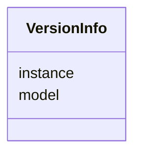

# Class: VersionInfo


_Provides version information._


URI: [schema:version](http://schema.org/version)





<!-- no inheritance hierarchy -->


## Slots

| Name | Cardinality and Range | Description | Inheritance |
| ---  | --- | --- | --- |
| [instance](instance.md) | 1..1 <br/> [String](String.md) |  | direct |
| [model](model.md) | 0..1 <br/> [String](String.md) |  | direct |


## Usages

| used by | used in | type | used |
| ---  | --- | --- | --- |
| [Thing](Thing.md) | [version](version.md) | range | [VersionInfo](VersionInfo.md) |


## Identifier and Mapping Information


### Schema Source


* from schema: td


## Mappings

| Mapping Type | Mapped Value |
| ---  | ---  |
| self | schema:version |
| native | td:VersionInfo |


## LinkML Source

<!-- TODO: investigate https://stackoverflow.com/questions/37606292/how-to-create-tabbed-code-blocks-in-mkdocs-or-sphinx -->

### Direct

<details>
```yaml
name: VersionInfo
description: Provides version information.
from_schema: td
attributes:
  instance:
    name: instance
    from_schema: td
    rank: 1000
    domain_of:
    - VersionInfo
    - Thing
    required: true
  model:
    name: model
    from_schema: td
    rank: 1000
    domain_of:
    - VersionInfo
class_uri: schema:version

```
</details>

### Induced

<details>
```yaml
name: VersionInfo
description: Provides version information.
from_schema: td
attributes:
  instance:
    name: instance
    from_schema: td
    rank: 1000
    alias: instance
    owner: VersionInfo
    domain_of:
    - VersionInfo
    - Thing
    range: string
    required: true
  model:
    name: model
    from_schema: td
    rank: 1000
    alias: model
    owner: VersionInfo
    domain_of:
    - VersionInfo
    range: string
class_uri: schema:version

```
</details>